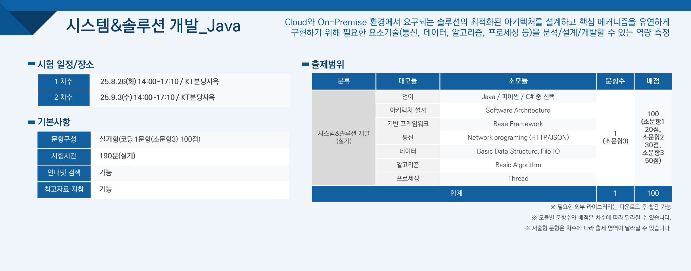
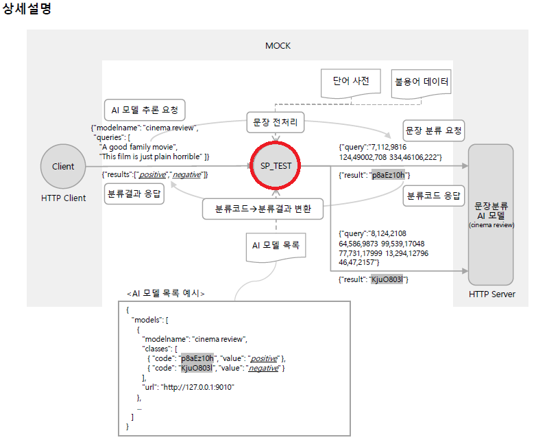
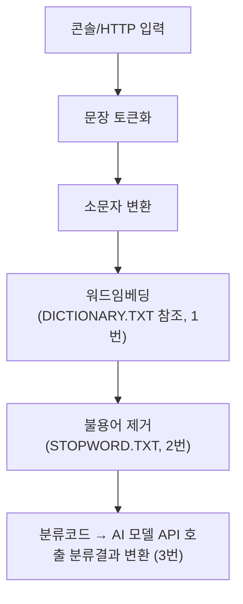
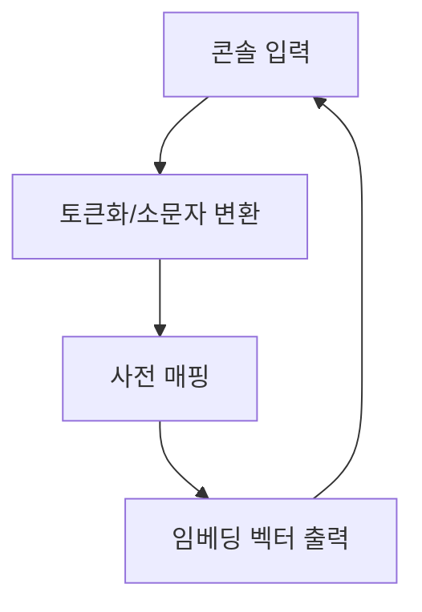
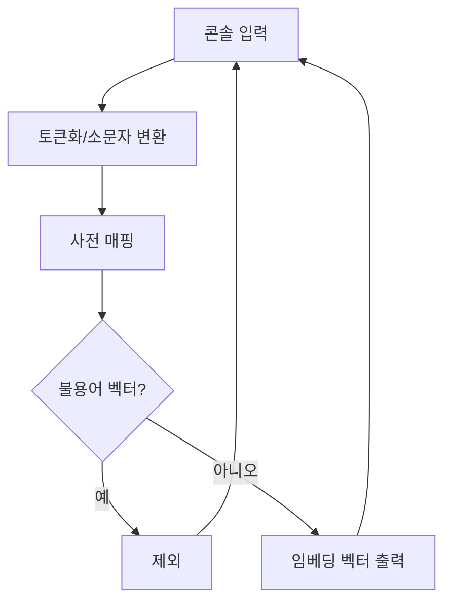
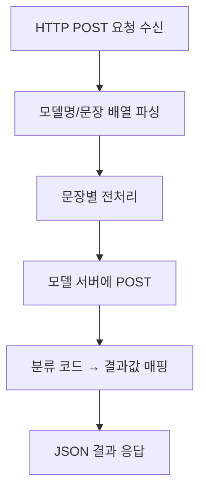

## KICE 시험준비 시스템&솔루션개발(Java)

[TOC]


## 소개



> [!NOTE]
>
> ```
> 학습 가이드 실습환경: 응시 환경에서 HTTP 통신 시나리오가 활용되는 경우 아래 Library 를 포함하여 제공할 예정이며 그 외 Library를 선택하여 다운로드하여 사용도 가능합니다.
> - Http Server : Jetty 9 Embedded
> - Http Client : Jetty 9 HttpClient
> - Json : Google Gson 2.10.1
> ```


## 준비사항

### 시험 환경

- 환경 : Cloud(원격데스크탑) 기반 통합개발환경

- 개발언어 : Java 8+

- 개발도구 : Eclipse

> [!CAUTION]
>
> Eclipse 에서 제공하는 Content Assist 기능이 비활성화되어 있다.
>
> Content Assist 기능 활성화 방법
>
> 1. **설정 창 열기**
>    - 상단 메뉴에서 **Window → Preferences**를 클릭
> 2. **Content Assist 메뉴 이동**
>    - 왼쪽 트리에서 **Java → Editor → Content Assist**를 선택.
> 3. **자동 활성화(Auto Activation) 설정**
>    - 우측에서 **Enable auto activation** 체크박스를 선택.

#### 실습환경 구성
> [!TIP]
>
> JDK 설치
>
> https://adoptium.net/temurin/releases/?version=17
>
> Eclise 설치
>
> https://www.eclipse.org/downloads/

### 시험 문항 프로젝트 구조

- 압축파일 형태로 링크 다운로드

  - 문제풀이 후 소스코드 다시 압축하여 업로드 필요

- 압축파일은 3개의 시험문항별 Java 프로젝트 존재

- 압축 해제 후 Eclpise Import 기능을 통해 프로젝트 로딩

  - 프로젝트 설정정보가 있을 경우 
    - Eclipse -> File -> Import -> General -> Existing Projects into Workspace -> 압축해제한 프로젝트 디렉토리 선택 -> Finish
  - 프로젝트 설정정보가 없는 경우
    - Eclipse -> New -> Java Project -> Project Name: 문항별 프로젝트명 입력, Location :  압축해제한 프로젝트 디렉토리 선택-> Finish 
  - 라이브러리 추가 시
    - Ecplise -> Package Explorer -> 추가할 라이브러리 우 클릭 ->  Build Path -> Add to Build Path

- 각 Java 프로젝트 내 제공 라이브러리 및 파일이 존재

- 프로젝트 내 소스코드는 Main문이 있는 하나의 파일만 제공

- 프로젝트 디렉토리 구성

  ```
  .
  ├── SP_TEST1
  │   ├── DICTIONARY.TXT
  │   └── src
  │       └── SP_TEST.java
  ├── SP_TEST2
  │   ├── DICTIONARY.TXT
  │   ├── STOPWORD.TXT
  │   └── src
  │       └── SP_TEST.java
  └── SP_TEST3
      ├── DICTIONARY.TXT
      ├── MODELS.JSON
      ├── STOPWORD.TXT
      ├── lib
      │   ├── gson-2.10.1.jar
      │   ├── javax.servlet-api-3.1.0.jar
      │   ├── jetty-client-9.4.53.v20231009.jar
      │   ├── jetty-http-9.4.53.v20231009.jar
      │   ├── jetty-io-9.4.53.v20231009.jar
      │   ├── jetty-server-9.4.53.v20231009.jar
      │   ├── jetty-servlet-9.4.53.v20231009.jar
      │   └── jetty-util-9.4.53.v20231009.jar
      └── src
          └── SP_TEST.java
  ```

  

### 시험 문항 풀이 구조 

- **총 3문항**으로 구성, 3시간 내 소스코드 개발 및 제출 필요

  - 상세설명 다이어그램 내 **SP_TEST** 영역에 대해서 소스코드 개발

    
    
  - 문항 분석 시 뒤에서 부터 확인. 

    - 문제 => 평가대상(최종결과물) => 형식정보(제약사항) => 상세설명(기능설명) 순으로 확인

  - 평가대상에 대해서 정확하게 이해 필요.

    - "프로그램 종료 없음" 은 소스코드 실행 시 종료되지 않고 반복처리 되어야 한다는 의미임.

- **문항 간 연계**: 1번 → 2번 → 3번 순서로 점진적 개선, 선행 문항이 후속 문항의 기반이 됨

- **실행 환경**

  - 각 문항별 Java 프로젝트가 사전에 생성되어 있음
  - 1, 2번: 콘솔 프로그램(단독 실행, 종료 없음)
  - 3번: HTTP 서버 형태(API 호출, 실시간 서비스)


### 각 문항별 흐름(Pilot 기준)

#### 문항 1: 문장 토큰화 및 워드임베딩

- **기능**
  - 콘솔로 문장 입력 → 공백 기준 단어 토큰화
  - 각 단어를 소문자로 변환 후, 단어 사전(DICTIONARY.TXT)에서 임베딩 벡터(정수 3개)로 변환
- **입력/출력**
  - 입력: 임의의 영어 문장(대소문자 혼용)
  - 출력: 각 단어의 임베딩 벡터를 공백으로 구분하여 한 줄로 출력
- **특이사항**
  - 프로그램 종료 없음, 계속 입력 및 출력 반복
  - 단어 사전 파일의 내용 하드코딩 금지, 반드시 파일 참조
  - 상대경로 사용 필수

#### 문항 2: 불용어(Stopword) 제거 추가

- **기능**
  - 문항 1의 전처리 과정에 **불용어 제거** 추가
  - 불용어 데이터(STOPWORD.TXT)에서 임베딩 벡터가 일치하는 단어는 최종 출력에서 제외
- **입력/출력**
  - 입력: 문항 1과 동일
  - 출력: 불용어를 제거한 단어들의 임베딩 벡터만 공백으로 구분해 출력
- **특이사항**
  - 불용어 데이터 역시 파일에서 읽어야 함
  - 프로그램 종료 없음, 계속 입력 및 출력 반복

#### 문항 3: AI 서비스 플랫폼(HTTP 서버)

- **기능**
  - HTTP POST 요청을 받아, 지정된 AI 모델로 문장 분류 결과를 반환
  - 요청: 모델명, 분류할 문장 리스트
  - 처리:
    - 각 문장에 대해 전처리(토큰화, 임베딩, 불용어 제거)
    - 전처리 결과를 AI 모델 서버에 POST, 분류코드 수신
    - 분류코드를 분류결과(예: positive/negative 등)로 변환
  - 응답: 분류결과 리스트를 JSON으로 반환
- **입력/출력**
  - 입력: HTTP POST (JSON 형식)
  - 출력: HTTP Response (JSON 형식)
- **특이사항**
  - 모델 목록, 분류코드-결과 매핑 등은 MODELS.JSON 파일에서 읽어야 함
  - 서버는 종료 없이 실시간 동작
  - 상대경로 사용 필수

#### 입력/출력 조건 요약

| 문항 | 입력 방식        | 출력 방식                  | 종료 조건 |
| :--- | :--------------- | :------------------------- | :-------- |
| 1    | 콘솔 문장 입력   | 임베딩 벡터(공백 구분)     | 종료 없음 |
| 2    | 콘솔 문장 입력   | 불용어 제거 후 임베딩 벡터 | 종료 없음 |
| 3    | HTTP POST (JSON) | HTTP Response (JSON)       | 종료 없음 |


#### 검증 및 평가 방식

- **1, 2번**: 콘솔 입/출력 결과를 샘플 결과 파일(CMP_CONSOLE.TXT)과 비교

  - Eclpise 통한 검증

    - Eclipse -> Package Explorer -> Main 문이 있는 Java 파일 우 클릭 ->   Run As -> Java Application 클릭

  - Terminal 통한 검증

    - Eclipse -> Package Explorer -> 프로젝트 컨텍스트 메뉴 클릭 -> Show In Local Terminal -> Teminal 클릭 

  - 실행방법

    ```sh
    javac -cp ".;lib/*" -d . src/Exam.java & java -cp ".;lib/*" Exam
    ```

- **3번**: MOCK.EXE 프로그램을 통해 API 테스트 시나리오 자동 실행, 모든 시나리오 통과 시 "테스트에 성공했습니다!" 메시지 출력

- **부분점수 없음**: 한 단계라도 오류 발생 시 후속 문항 전체 오류 처리

- **전체 소스코드 압축해서 제출**


#### 정책 및 참고 데이터 제공

- **정책/참고 데이터 파일**
  - 프로젝트 내 파일형태로 제공
  - DICTIONARY.TXT: 단어-임베딩 벡터 매핑
  - STOPWORD.TXT: 불용어 임베딩 벡터 목록
  - MODELS.JSON: AI 모델 정보, 분류코드-분류결과 매핑, 모델별 API URL
  
- **파일 내용 하드코딩 금지**, 반드시 파일 입출력 코드 구현
  - 검증 시 사용하는 데이터 파일 내용 다름

- **모든 경로는 상대경로**로 처리
  - 실제 검증 시 디렉토리 다를 수 있음


### 전체 시스템 흐름




### 주의사항

실행 결과로 평가하고 부분점수는 없으므로 아래사항을 필히 주의해야 함

- 구현된 프로그램은 실행 완결성 필수 (명확한 실행&정확한 결과 출력, 통상의 실행 시간)
- 소 문항별 결과 검수 필수 (선행문항 오류 시, 후속문항 전체에 오류가 발생할 수 있음)
- 제시된 조건이 없는 한 선행요구사항 유지 필수
- 프로그램 실행 위치 및 실행결과출력 (위치, 파일명, 데이터포맷)은 요구사항과 정확히 일치 필수
(콘솔 출력이 평가 대상일 경우 불필요한 로그 출력 금지)
- 제시된 모든 위치는 상대경로 사용 필수 (프로그램 실행 위치 기준)
- 프로그램 종료조건에 맞는 처리 필수 (불필요한 입력대기를 하거나, 요구사항과 다르게 종료하면
안됨)
- 제공되는 샘플 파일과 다른 데이터로 채점하므로 제공되는 파일의 내용을 하드코딩하지 말 것
- 모든 문자는 요구사항에 맞는 대소문자 구분 필수


### 주요 알고리즘

| 주요 알고리즘/핵심 포인트     | 학습 포인트                         |
| :---------------------------- | :---------------------------------- |
| 문자열 분할(split)            | 공백 기준 분할, 특수문자 처리       |
| 해시맵(딕셔너리) 기반 탐색    | 파일 읽기, 키-값 매핑, 예외처리     |
| 집합(set) 연산, 리스트 필터링 | 벡터 일치 여부로 필터링             |
| 파일 파싱, 상대경로 처리      | 하드코딩 금지, 경로 오류 방지       |
| ***JSON 직렬화/역직렬화***    | ***요청/응답 포맷 일치, 오류처리*** |
| ***HTTP 처리***               | ***HTTP Server/Clinet***            |


### 제공 라이브러리

| 라이브러리              | 주요 특징                                                    | 대표 용도/활용 예시                              |
| :---------------------- | :----------------------------------------------------------- | :----------------------------------------------- |
| Jetty 9 Embedded Server | - 경량/고성능 Java HTTP 서버 - 애플리케이션에 내장(임베디드) 가능 - Servlet, REST API, WebSocket 지원 - 비동기 처리 및 다양한 확장성 제공 | REST API 서버, 내장 웹서비스, 마이크로서비스     |
| Jetty 9 HttpClient      | - 동기/비동기 HTTP 요청 지원 - HTTP/1.1, HTTP/2 등 최신 프로토콜 지원 - 경량 구조, 빠른 처리 - 커스텀 헤더, 쿠키, 인증 등 네트워크 옵션 풍부 | 외부 API 연동, 서비스 간 통신, 테스트 클라이언트 |
| Google Gson 2.10.1      | - Java 객체 ↔ JSON 직렬화/역직렬화 - 컬렉션, 제네릭, 트리모델 지원 - 경량, 빠른 성능 - 별도 어노테이션 없이 POJO 사용 가능 | JSON 데이터 파싱/생성, REST API 데이터 처리      |

#### Jetty 9 Embedded HTTP Server 

Jetty 9를 임베디드 HTTP 서버로 사용하여 간단한 REST API를 구현하는 예시.

```java
import org.eclipse.jetty.server.Server;
import org.eclipse.jetty.servlet.ServletHandler;
import javax.servlet.http.*;
import javax.servlet.*;

public class JettyEmbeddedExample {
    public static void main(String[] args) throws Exception {
        Server server = new Server(8080); // 8080 포트로 Jetty 서버 인스턴스 생성

        ServletHandler handler = new ServletHandler(); // 서블릿 핸들러 준비
        handler.addServletWithMapping(HelloServlet.class, "/hello"); // "/hello" 경로에 서블릿 매핑
        server.setHandler(handler); // 서버에 핸들러 등록

        server.start(); // 서버 시작
        server.join();  // 메인 스레드 대기(서버 종료까지)
    }

    // 간단한 Hello 서블릿 구현
    public static class HelloServlet extends HttpServlet {
        /**
		 * 
		 */
		private static final long serialVersionUID = 1L;
		
		@Override
        protected void doGet(HttpServletRequest req, HttpServletResponse resp) throws ServletException, java.io.IOException {
			
	        String requestURL = req.getRequestURL().toString();
	        String requestURI = req.getRequestURI();
	        String contextPath = req.getContextPath();
	        String servletPath = req.getServletPath();
	        String queryString = req.getQueryString();
	        
	        System.out.println("Request URL: " + requestURL);
	        System.out.println("Request URI: " + requestURI);
	        System.out.println("Context Path: " + contextPath);
	        System.out.println("Servlet Path: " + servletPath);
	        System.out.println("Query String: " + queryString);
	        
            resp.setContentType("text/plain; charset=utf-8");
            resp.getWriter().write("[GET]Hello, Jetty Embedded!");

        }
        @Override
        protected void doPost(HttpServletRequest req, HttpServletResponse resp) throws ServletException, java.io.IOException {
	        
	        String requestURL = req.getRequestURL().toString();
	        String requestURI = req.getRequestURI();
	        String contextPath = req.getContextPath();
	        String servletPath = req.getServletPath();
	        String queryString = req.getQueryString();
	        
	        System.out.println("Request URL: " + requestURL);
	        System.out.println("Request URI: " + requestURI);
	        System.out.println("Context Path: " + contextPath);
	        System.out.println("Servlet Path: " + servletPath);
	        System.out.println("Query String: " + queryString);
	        
            resp.setContentType("application/json; charset=utf-8");
            resp.getWriter().write("[POST]Hello, Jetty Embedded!");
        }        
    }
}
```

####  Jetty 9 HttpClient 샘플 코드

Jetty 9의 HttpClient로 JSON 데이터를 POST로 전송하고 응답을 받는 예시.

```java
import org.eclipse.jetty.client.HttpClient;
import org.eclipse.jetty.client.api.ContentResponse;
import org.eclipse.jetty.client.util.StringContentProvider;
import org.eclipse.jetty.http.HttpHeader;

public class JettyHttpClientExample {
    public static void main(String[] args) throws Exception {
        HttpClient httpClient = new HttpClient(); // HttpClient 인스턴스 생성
        httpClient.start(); // 내부 리소스 초기화

        // 전송할 JSON 데이터 생성
        String processed = "sample query";
        String json = String.format("{\"query\":\"%s\"}", processed);

        // POST 요청 생성 및 전송
        ContentResponse response = httpClient.POST("http://localhost:8080/hello") // 요청 URL
            .header(HttpHeader.CONTENT_TYPE, "application/json")                  // Content-Type 헤더 지정
            .content(new StringContentProvider(json), "application/json")          // 요청 바디에 JSON 데이터 설정
            .send();                                                              // 동기 요청

        String responseBody = response.getContentAsString(); // 응답 본문 추출
        System.out.println("서버 응답: " + responseBody);

        httpClient.stop(); // 리소스 반환
    }
}
```

#### Google Gson 2.10.1 샘플 코드

#####  Java 객체 → JSON 문자열 변환

```java
import com.google.gson.Gson;

public class GsonToJsonExample {
    public static void main(String[] args) {
        Person person = new Person("홍길동", 25);
        Gson gson = new Gson();
        String json = gson.toJson(person);
        System.out.println(json); // {"name":"홍길동","age":25}
    }
    static class Person {
        String name;
        int age;
        Person(String name, int age) { this.name = name; this.age = age; }
    }
}
```


#####  JSON 문자열 → Java 객체 변환

```java
import com.google.gson.Gson;

public class GsonFromJsonExample {
    public static void main(String[] args) {
        String json = "{\"name\":\"홍길동\",\"age\":25}";
        Gson gson = new Gson();
        Person person = gson.fromJson(json, Person.class);
        System.out.println(person.name); // 홍길동
        System.out.println(person.age);  // 25
    }
    static class Person {
        String name;
        int age;
    }
}
```


#### 주요 기능 요약표

| 기능               | 메서드 예시                          | 설명                      |
| :----------------- | :----------------------------------- | :------------------------ |
| 객체 → JSON 문자열 | `gson.toJson(obj)`                   | Java 객체를 JSON으로 변환 |
| JSON → 객체        | `gson.fromJson(json, Class)`         | JSON을 Java 객체로 변환   |
| Map ↔ JSON         | `gson.toJson(map)` / `fromJson(...)` | Map과 JSON 상호 변환      |
| 컬렉션/배열 지원   | `fromJson(json, TypeToken)`          | List, Set 등 제네릭 지원  |
| 트리 모델 파싱     | `JsonParser.parseString(json)`       | JsonObject/JsonArray 사용 |
| Pretty Printing    | `GsonBuilder().setPrettyPrinting()`  | 보기 좋은 JSON 출력       |


##### JsonObject/JsonArray 직접 다루기

```java
import com.google.gson.JsonArray;
import com.google.gson.JsonElement;
import com.google.gson.JsonObject;
import com.google.gson.JsonParser;

public class JsonTreeExample {
    public static void main(String[] args) {
        String json = "{\"id\":1,\"students\":[\"Anna\",\"Jerry\"],\"subject\":{\"name\":\"Java\",\"professor\":\"Tony\"}}";
        JsonElement element = JsonParser.parseString(json);
        JsonObject object = element.getAsJsonObject();
        long id = object.get("id").getAsLong();
        JsonArray students = object.get("students").getAsJsonArray();
        for (JsonElement stu : students) {
            System.out.println(stu.getAsString());
        }
        JsonObject subject = object.get("subject").getAsJsonObject();
        System.out.println(subject.get("name").getAsString());
    }
}
```

##### Java객체 다루기

```java
import com.google.gson.Gson;
import java.util.List;

// Subject 클래스 정의 (JSON의 subject 객체와 매핑)
class Subject {
    private String name;
    private String professor;
    
    // Getter 메서드들
    public String getName() {
        return name;
    }
    
    public String getProfessor() {
        return professor;
    }
}

// StudentInfo 클래스 정의 (전체 JSON 구조와 매핑)
class StudentInfo {
    private long id;
    private List<String> students;
    private Subject subject;
    
    // Getter 메서드들
    public long getId() {
        return id;
    }
    
    public List<String> getStudents() {
        return students;
    }
    
    public Subject getSubject() {
        return subject;
    }
}

public class JsonToObjectExample {
    public static void main(String[] args) {
        // 원본 JSON 문자열 그대로 유지
        String json = "{\"id\":1,\"students\":[\"Anna\",\"Jerry\"],\"subject\":{\"name\":\"Java\",\"professor\":\"Tony\"}}";
        
        // Gson을 사용하여 JSON을 Java 객체로 변환
        Gson gson = new Gson();
        StudentInfo studentInfo = gson.fromJson(json, StudentInfo.class);
        
        // 원본 코드와 동일한 출력 순서로 데이터 출력
        long id = studentInfo.getId();
        System.out.println("id: " + id);
        
        List<String> students = studentInfo.getStudents();
        
        // 학생 이름들 출력 (원본 코드의 for 루프와 동일)
        for (String stu : students) {
            System.out.println(stu);
        }
        
        // 과목명 출력 (원본 코드의 마지막 출력과 동일)
        System.out.println(studentInfo.getSubject().getName());
    }
}
```

#####  컬렉션, 제네릭 타입 파싱

```java
import com.google.gson.reflect.TypeToken;
// ...
String json = "[{\"name\":\"홍길동\",\"age\":25},{\"name\":\"이순신\",\"age\":30}]";
Type listType = new TypeToken<List<Person>>(){}.getType();
List<Person> people = gson.fromJson(json, listType);
```

 

## 기출문제 풀이(Pilot)

> [!NOTE]
>
> #### 목표 시스템
>
> AI 서비스 플랫폼
>
> #### 개요
>
> 해당 시스템 구현을 통해 요구사항 분석, 데이터 구조화, HTTP Server/Client 구현 등의 기술역량
> 및 프로그램 구현 역량을 측정하기 위한 문제입니다.
>
> #### 설명
>
> 본 프로그램은 사전학습된 AI 모델을 활용하여 요청 받은 Query 문장들에 대한 분류를 수행하고
> 결과를 제공하는 AI 서비스 플랫폼입니다.


### 문항 1: 콘솔 입력 문장 토큰화 및 워드임베딩

**기능 요약:**

- 콘솔에서 문장 입력 → 단어별 소문자 변환 → 사전(DICTIONARY.TXT)에서 임베딩 벡터 매핑 → 결과 출력
- 종료 없이 반복 입력/출력


#### 구성도



#### 실행 코드

```java
import java.io.BufferedReader;
import java.io.FileReader;
import java.io.IOException;
import java.util.ArrayList;
import java.util.HashMap;
import java.util.List;
import java.util.Map;
import java.util.Scanner;

public class SP_TEST {
    // 단어 사전 저장용 Map
    private static final Map<String, String> dictionary = new HashMap<>();

    public static void main(String[] args) throws Exception {
        loadDictionary("DICTIONARY.TXT");
        Scanner scanner = new Scanner(System.in);
        while (true) {
            String line = scanner.nextLine();
            String[] tokens = line.trim().split("\\s+");
            List<String> vectors = new ArrayList<>();
            for (String token : tokens) {
                String key = token.toLowerCase();
                if (dictionary.containsKey(key)) {
                    vectors.add(dictionary.get(key));
                }
            }
            System.out.println(String.join(" ", vectors));
        }
    }

    // 단어 사전 파일 로드
    private static void loadDictionary(String path) throws IOException {
        try (BufferedReader br = new BufferedReader(new FileReader(path))) {
            String line;
            while ((line = br.readLine()) != null) {
                String[] parts = line.split("#");
                if (parts.length == 2) {
                    dictionary.put(parts[0], parts[1]);
                }
            }
        }
    }
}
```

#### 코드 설명

- `loadDictionary`: DICTIONARY.TXT 파일을 읽어 단어-벡터 매핑
- `main`: 입력 문장 토큰화, 소문자 변환, 사전 참조, 결과 출력
- **반복 입력/출력, 종료 없음**


### 문항 2: 불용어(Stopword) 제거 추가

**기능 요약:**

- STOPWORD.TXT의 벡터 목록을 불용어로 사용
- 임베딩 벡터가 불용어에 포함되면 출력에서 제외


#### 구성도



#### 실행 코드 (불용어 처리 추가)

```java
import java.io.BufferedReader;
import java.io.FileReader;
import java.io.IOException;
import java.util.ArrayList;
import java.util.HashMap;
import java.util.HashSet;
import java.util.List;
import java.util.Map;
import java.util.Scanner;
import java.util.Set;

public class SP_TEST {
    private static final Map<String, String> dictionary = new HashMap<>();
    private static final Set<String> stopwords = new HashSet<>();

    public static void main(String[] args) throws Exception {
        loadDictionary("DICTIONARY.TXT");
        loadStopwords("STOPWORD.TXT");
        Scanner scanner = new Scanner(System.in);
        while (true) {
            String line = scanner.nextLine();
            String[] tokens = line.trim().split("\\s+");
            List<String> vectors = new ArrayList<>();
            for (String token : tokens) {
                String key = token.toLowerCase();
                String vector = dictionary.get(key);
                if (vector != null && !stopwords.contains(vector)) {
                    vectors.add(vector);
                }
            }
            System.out.println(String.join(" ", vectors));
        }
    }

    private static void loadDictionary(String path) throws IOException {
        try (BufferedReader br = new BufferedReader(new FileReader(path))) {
            String line;
            while ((line = br.readLine()) != null) {
                String[] parts = line.split("#");
                if (parts.length == 2) {
                    dictionary.put(parts[0], parts[1]);
                }
            }
        }
    }

    private static void loadStopwords(String path) throws IOException {
        try (BufferedReader br = new BufferedReader(new FileReader(path))) {
            String line;
            while ((line = br.readLine()) != null) {
                stopwords.add(line.trim());
            }
        }
    }
}
```


#### 코드 설명

- `loadStopwords`: STOPWORD.TXT의 각 줄을 Set에 저장
- 메인 로직에서 불용어 벡터는 출력에서 제외


### 문항 3: Jetty 기반 HTTP 서버 + AI 모델 연동

**기능 요약:**

- POST 요청으로 AI 모델명/문장 배열 수신
- 각 문장 전처리(토큰화, 임베딩, 불용어 제거)
- 모델 서버에 HTTP POST로 분류 요청, 결과 코드 → 결과값 변환
- 최종 결과 JSON 응답


#### 구성도



#### Jetty + Gson 활용 예시 코드

```java
import java.io.BufferedReader;
import java.io.FileReader;
import java.io.IOException;
import java.io.InputStreamReader;
import java.io.Reader;
import java.util.ArrayList;
import java.util.HashMap;
import java.util.HashSet;
import java.util.List;
import java.util.Map;
import java.util.Set;

import javax.servlet.http.HttpServlet;
import javax.servlet.http.HttpServletRequest;
import javax.servlet.http.HttpServletResponse;

import org.eclipse.jetty.client.HttpClient;
import org.eclipse.jetty.client.api.ContentResponse;
import org.eclipse.jetty.client.util.StringContentProvider;
import org.eclipse.jetty.http.HttpHeader;
import org.eclipse.jetty.server.Server;
import org.eclipse.jetty.servlet.ServletHandler;

import com.google.gson.Gson;
import com.google.gson.JsonArray;
import com.google.gson.JsonElement;
import com.google.gson.JsonObject;

public class SP_TEST {
    private static final Map<String, String> dictionary = new HashMap<>();
    private static final Set<String> stopwords = new HashSet<>();
    private static final List<ModelInfo> models = new ArrayList<>();

    public static void main(String[] args) throws Exception {
        loadDictionary("DICTIONARY.TXT");
        loadStopwords("STOPWORD.TXT");
        loadModels("MODELS.JSON");

        Server server = new Server(8080);
        ServletHandler handler = new ServletHandler();
        handler.addServletWithMapping(MainServlet.class, "/");
        server.setHandler(handler);
        server.start();
        server.join();
    }

    // 모델 정보 클래스
    public static class ModelInfo {
        String modelname;
        String url;
        List<ClassInfo> classes;
    }
    public static class ClassInfo {
        String code;
        String value;
    }

    // 메인 서블릿
    public static class MainServlet extends HttpServlet {
        @Override
        protected void doPost(HttpServletRequest req, HttpServletResponse resp) throws IOException {
            Gson gson = new Gson();
            JsonObject requestJson = gson.fromJson(new InputStreamReader(req.getInputStream()), JsonObject.class);
            String modelName = requestJson.get("modelname").getAsString();
            JsonArray queries = requestJson.getAsJsonArray("queries");

            ModelInfo model = models.stream().filter(m -> m.modelname.equals(modelName)).findFirst().orElse(null);
            if (model == null) {
                resp.setStatus(400);
                resp.getWriter().write("{\"error\":\"Model not found\"}");
                return;
            }

            List<String> results = new ArrayList<>();
            for (JsonElement queryElem : queries) {
                String query = queryElem.getAsString();
                String processed = preprocess(query);
                String code = requestModel(model.url, processed);
                String value = model.classes.stream().filter(c -> c.code.equals(code)).map(c -> c.value).findFirst().orElse("unknown");
                results.add(value);
            }
            JsonObject responseJson = new JsonObject();
            JsonArray resArr = new JsonArray();
            for (String r : results) resArr.add(r);
            responseJson.add("results", resArr);

            resp.setContentType("application/json");
            resp.getWriter().write(gson.toJson(responseJson));
        }

        // 문장 전처리 (토큰화, 임베딩, 불용어 제거)
        private String preprocess(String sentence) {
            String[] tokens = sentence.trim().split("\\s+");
            List<String> vectors = new ArrayList<>();
            for (String token : tokens) {
                String key = token.toLowerCase();
                String vector = dictionary.get(key);
                if (vector != null && !stopwords.contains(vector)) {
                    vectors.add(vector);
                }
            }
            return String.join(" ", vectors);
        }

        // 모델 서버에 HTTP POST 요청 (Jetty 9 HttpClient)
        private String requestModel(String url, String processed) throws Exception {
            Gson gson = new Gson(); // Gson 인스턴스
            HttpClient httpClient = new HttpClient(); // Jetty HttpClient 생성
            httpClient.start(); // HttpClient 시작

            // JSON 바디 생성
            String json = String.format("{\"query\":\"%s\"}", processed);

            // POST 요청 생성 및 전송
            ContentResponse response = httpClient.POST(url)
                .header(HttpHeader.CONTENT_TYPE, "application/json")        // Content-Type 지정
                .content(new StringContentProvider(json), "application/json") // JSON 바디 설정
                .send();                                                    // 동기 전송

            // 응답 코드 및 바디 처리
            String responseBody = response.getContentAsString();
            JsonObject res = gson.fromJson(responseBody, JsonObject.class);
            httpClient.stop(); // HttpClient 종료 (실전에서는 재사용 권장)

            return res.get("result").getAsString(); // 결과 추출
        }
    }

    // 사전, 불용어, 모델 로드 메소드 (문항1-2와 동일)
    private static void loadDictionary(String path) throws IOException { /* ... */ }
    private static void loadStopwords(String path) throws IOException { /* ... */ }
    private static void loadModels(String path) throws IOException {
        Gson gson = new Gson();
        try (Reader reader = new FileReader(path)) {
            JsonObject obj = gson.fromJson(reader, JsonObject.class);
            JsonArray arr = obj.getAsJsonArray("models");
            for (JsonElement e : arr) {
                models.add(gson.fromJson(e, ModelInfo.class));
            }
        }
    }
}
```


#### 코드 설명

- Jetty 내장 서버로 HTTP POST 요청 수신
- Gson으로 JSON 파싱 및 응답
- 모델 정보, 분류 코드-값 매핑
- 각 문장 전처리 후 모델 서버에 POST, 결과 코드 변환
- 예외 및 오류 처리
- 모든 클래스/메소드/변수에 주석 필수


## 공통 유틸

### Stream

Java Stream API는 Java 8부터 도입된 기능으로, 컬렉션(List, Set 등)이나 배열에 저장된 데이터를 함수형 스타일로 효율적이고 간결하게 처리할 수 있게 해줍니다. 데이터를 반복, 필터링, 매핑, 집계 등 다양한 연산을 손쉽게 수행할 수 있습니다.

#### Stream의 주요 특징

- **함수형 프로그래밍 지원**: 람다(Lambda)와 함께 사용하여 코드가 간결해짐
- **내부 반복(Internal Iteration)**: for-each 대신 내부적으로 반복 처리
- **불변성**: 원본 데이터 변경 없이 새로운 결과 생성
- **지연 연산(Lazy Evaluation)**: 최종 연산이 실행될 때 실제로 처리됨
- **병렬 처리 지원**: parallelStream()으로 손쉽게 병렬 연산 가능


#### Stream 기본 구조

```java
컬렉션.stream()
    .중간연산1()
    .중간연산2()
    ...
    .최종연산();
```

- **중간연산**: filter, map, sorted 등 (Stream 반환)
- **최종연산**: forEach, collect, count 등 (Stream 종료)


#### 주요 연산별 사용법 및 예제

##### 1) 생성 (Stream 생성)

| 방법         | 예시 코드            |
| :----------- | :------------------- |
| 리스트에서   | `list.stream()`      |
| 배열에서     | `Arrays.stream(arr)` |
| 값 직접 지정 | `Stream.of(1, 2, 3)` |

```java
List<String> names = Arrays.asList("Tom", "Jerry", "Anna");
Stream<String> stream = names.stream();
```


##### 2) 중간 연산

- **filter**: 조건에 맞는 요소만 추출
- **map**: 각 요소를 변환
- **sorted**: 정렬
- **distinct**: 중복 제거
- **limit, skip**: 일부만 선택

```java
List<String> names = Arrays.asList("Tom", "Jerry", "Anna", "Tom");
List<String> result = names.stream()
    .filter(name -> name.length() > 3)     // 길이 3 초과만
    .map(String::toUpperCase)              // 대문자 변환
    .distinct()                            // 중복 제거
    .sorted()                              // 정렬
    .collect(Collectors.toList());         // 리스트로 수집
System.out.println(result);
```

> 출력: `[JERRY, ANNA]`

##### 3) 최종 연산

- **collect**: 결과를 컬렉션 등으로 수집
- **forEach**: 각 요소에 작업 수행
- **count**: 요소 개수 반환
- **anyMatch, allMatch, noneMatch**: 조건 일치 여부 확인
- **reduce**: 누적 집계(합계, 곱 등)

```java
List<Integer> numbers = Arrays.asList(1, 2, 3, 4, 5);
int sum = numbers.stream().reduce(0, Integer::sum); // 합계
System.out.println(sum); // 15
```

#### 예제 1

문자열 리스트에서 조건에 맞는 요소 추출 및 가공

```java
import java.util.Arrays;
import java.util.List;
import java.util.stream.Collectors;

public class StreamExample {
    public static void main(String[] args) {
        List<String> names = Arrays.asList("Tom", "Jerry", "Anna", "Tom", "Mike");

        // 4글자 이상인 이름을 대문자로 변환, 중복 제거, 정렬 후 리스트로 반환
        List<String> result = names.stream()
            .filter(name -> name.length() >= 4)
            .map(String::toUpperCase)
            .distinct()
            .sorted()
            .collect(Collectors.toList());

        System.out.println(result); // [ANNA, JERRY, MIKE]
    }
}
```

#### 예제 2

숫자 리스트에서 짝수만 제곱하여 합계 구하기

```java
import java.util.Arrays;
import java.util.List;

public class StreamNumberExample {
    public static void main(String[] args) {
        List<Integer> numbers = Arrays.asList(1, 2, 3, 4, 5, 6);

        int sumOfSquares = numbers.stream()
            .filter(n -> n % 2 == 0)     // 짝수만
            .map(n -> n * n)             // 제곱
            .reduce(0, Integer::sum);    // 합계

        System.out.println(sumOfSquares); // 56 (2*2 + 4*4 + 6*6)
    }
}
```

#### 병렬 스트림(Parallel Stream)

대용량 데이터 처리 시 병렬로 작업할 수 있습니다.

```java
List<Integer> numbers = Arrays.asList(1,2,3,4,5,6,7,8,9,10);
long count = numbers.parallelStream()
    .filter(n -> n % 2 == 0)
    .count();
System.out.println(count); // 5
```


### String 

#### length() - 문자열 길이 반환

문자열의 길이를 반환합니다.

```java
public class StringLengthExample {
    public static void main(String[] args) {
        String str = "Hello World";
        System.out.println("문자열 길이: " + str.length()); // 출력: 11
        
        String empty = "";
        System.out.println("빈 문자열 길이: " + empty.length()); // 출력: 0
    }
}
```

#### charAt(int index) - 특정 위치의 문자 반환

지정된 인덱스 위치의 문자를 반환합니다.

```java
public class CharAtExample {
    public static void main(String[] args) {
        String str = "Java Programming";
        
        System.out.println("첫 번째 문자: " + str.charAt(0)); // 출력: J
        System.out.println("다섯 번째 문자: " + str.charAt(4)); // 출력: (공백)
        
        // 마지막 문자 접근
        System.out.println("마지막 문자: " + str.charAt(str.length() - 1)); // 출력: g
    }
}
```

#### substring() - 부분 문자열 추출

문자열의 일부를 추출합니다.

```java
public class SubstringExample {
    public static void main(String[] args) {
        String str = "Hello World Java";
        
        // 시작 인덱스부터 끝까지
        System.out.println(str.substring(6)); // 출력: World Java
        
        // 시작 인덱스부터 끝 인덱스 전까지
        System.out.println(str.substring(0, 5)); // 출력: Hello
        System.out.println(str.substring(6, 11)); // 출력: World
    }
}
```

#### indexOf() / lastIndexOf() - 문자열 검색

특정 문자나 문자열의 위치를 찾습니다.

```java
public class IndexOfExample {
    public static void main(String[] args) {
        String str = "Java is great, Java is powerful";
        
        // 첫 번째 발생 위치
        System.out.println("Java의 첫 번째 위치: " + str.indexOf("Java")); // 출력: 0
        System.out.println("is의 첫 번째 위치: " + str.indexOf("is")); // 출력: 5
        
        // 마지막 발생 위치
        System.out.println("Java의 마지막 위치: " + str.lastIndexOf("Java")); // 출력: 15
        
        // 없는 문자열 검색
        System.out.println("Python 위치: " + str.indexOf("Python")); // 출력: -1
    }
}
```

#### contains() - 문자열 포함 여부 확인

문자열이 특정 문자열을 포함하는지 확인합니다.

```java
public class ContainsExample {
    public static void main(String[] args) {
        String str = "Java Programming Language";
        
        System.out.println("Java 포함: " + str.contains("Java")); // 출력: true
        System.out.println("Python 포함: " + str.contains("Python")); // 출력: false
        System.out.println("Program 포함: " + str.contains("Program")); // 출력: true
    }
}
```

#### startsWith() / endsWith() - 시작/끝 문자열 확인

문자열이 특정 문자열로 시작하거나 끝나는지 확인합니다.

```java
public class StartsEndsWithExample {
    public static void main(String[] args) {
        String filename = "document.pdf";
        String url = "https://www.example.com";
        
        System.out.println("PDF 파일인가: " + filename.endsWith(".pdf")); // 출력: true
        System.out.println("HTTPS 프로토콜인가: " + url.startsWith("https")); // 출력: true
        System.out.println("DOC 파일인가: " + filename.endsWith(".doc")); // 출력: false
    }
}
```

#### toUpperCase() / toLowerCase() - 대소문자 변환

문자열을 대문자 또는 소문자로 변환합니다.

```java
public class CaseConversionExample {
    public static void main(String[] args) {
        String str = "Hello World";
        
        System.out.println("대문자: " + str.toUpperCase()); // 출력: HELLO WORLD
        System.out.println("소문자: " + str.toLowerCase()); // 출력: hello world
        
        // 원본 문자열은 변경되지 않음
        System.out.println("원본: " + str); // 출력: Hello World
    }
}
```

#### trim() - 공백 제거

문자열 양 끝의 공백을 제거합니다.

```java
public class TrimExample {
    public static void main(String[] args) {
        String str = "  Hello World  ";
        
        System.out.println("원본: '" + str + "'"); // 출력: '  Hello World  '
        System.out.println("trim 후: '" + str.trim() + "'"); // 출력: 'Hello World'
        
        // 중간 공백은 제거되지 않음
        String str2 = "  Hello   World  ";
        System.out.println("trim 후: '" + str2.trim() + "'"); // 출력: 'Hello   World'
    }
}
```

#### replace() / replaceAll() - 문자열 치환

문자열을 다른 문자열로 치환합니다.

```java
public class ReplaceExample {
    public static void main(String[] args) {
        String str = "Hello World Java World";
        
        // 모든 발생 치환
        System.out.println(str.replace("World", "Universe")); 
        // 출력: Hello Universe Java Universe
        
        // 정규식을 사용한 치환
        String text = "Java123Python456";
        System.out.println(text.replaceAll("\\d+", "-")); // 출력: Java-Python-
        
        // 첫 번째 발생만 치환
        System.out.println(str.replaceFirst("World", "Universe")); 
        // 출력: Hello Universe Java World
    }
}
```

#### split() - 문자열 분리

구분자를 기준으로 문자열을 배열로 분리합니다.

```java
public class SplitExample {
    public static void main(String[] args) {
        String str = "apple,banana,orange";
        String[] fruits = str.split(",");
        
        for (String fruit : fruits) {
            System.out.println(fruit); // apple, banana, orange 순서대로 출력
        }
        
        // 정규식을 사용한 분리
        String text = "Java123Python456C++";
        String[] languages = text.split("\\d+");
        
        for (String lang : languages) {
            System.out.println(lang); // Java, Python, C++ 순서대로 출력
        }
    }
}
```

#### equals() / equalsIgnoreCase() - 문자열 비교

문자열을 비교합니다.

```java
public class EqualsExample {
    public static void main(String[] args) {
        String str1 = "Hello";
        String str2 = "Hello";
        String str3 = "hello";
        String str4 = new String("Hello");
        
        // 대소문자 구분 비교
        System.out.println(str1.equals(str2)); // 출력: true
        System.out.println(str1.equals(str3)); // 출력: false
        System.out.println(str1.equals(str4)); // 출력: true
        
        // 대소문자 무시 비교
        System.out.println(str1.equalsIgnoreCase(str3)); // 출력: true
        
        // == 연산자와의 차이
        System.out.println(str1 == str2); // 출력: true (문자열 리터럴)
        System.out.println(str1 == str4); // 출력: false (다른 객체)
    }
}
```

#### isEmpty() / isBlank() - 빈 문자열 확인

문자열이 비어있는지 확인합니다.

```java
public class EmptyBlankExample {
    public static void main(String[] args) {
        String empty = "";
        String spaces = "   ";
        String text = "Hello";
        
        // isEmpty() - 길이가 0인지 확인
        System.out.println("empty.isEmpty(): " + empty.isEmpty()); // 출력: true
        System.out.println("spaces.isEmpty(): " + spaces.isEmpty()); // 출력: false
        System.out.println("text.isEmpty(): " + text.isEmpty()); // 출력: false
        
        // isBlank() - 공백만 있거나 빈 문자열인지 확인 (Java 11+)
        System.out.println("empty.isBlank(): " + empty.isBlank()); // 출력: true
        System.out.println("spaces.isBlank(): " + spaces.isBlank()); // 출력: true
        System.out.println("text.isBlank(): " + text.isBlank()); // 출력: false
    }
}
```

#### valueOf() - 다른 타입을 문자열로 변환

다양한 타입의 값을 문자열로 변환합니다.

```java
public class ValueOfExample {
    public static void main(String[] args) {
        int number = 123;
        boolean flag = true;
        double decimal = 3.14;
        char character = 'A';
        
        System.out.println("숫자: " + String.valueOf(number)); // 출력: 123
        System.out.println("불린: " + String.valueOf(flag)); // 출력: true
        System.out.println("실수: " + String.valueOf(decimal)); // 출력: 3.14
        System.out.println("문자: " + String.valueOf(character)); // 출력: A
        
        // null 안전성
        String nullStr = null;
        System.out.println("null: " + String.valueOf(nullStr)); // 출력: null
    }
}
```

#### format() - 문자열 포맷팅

형식화된 문자열을 생성합니다.

기본 사용법

```java
String result = String.format("이름: %s, 나이: %d", "홍길동", 25);
System.out.println(result); // 출력: 이름: 홍길동, 나이: 25
```

- `%s`: 문자열
- `%d`: 정수
- `%f`: 실수(소수점)
- `%n`: 줄바꿈(플랫폼 독립)

#### 주요 포맷 지정자

| 포맷 지정자 | 설명              | 예시 값 | 결과 예시 |
| :---------- | :---------------- | :------ | :-------- |
| `%s`        | 문자열            | "Java"  | Java      |
| `%d`        | 10진수 정수       | 123     | 123       |
| `%f`        | 실수(기본 소수 6) | 3.14    | 3.140000  |
| `%c`        | 문자              | 'A'     | A         |
| `%b`        | boolean           | true    | true      |
| `%x`        | 16진수            | 255     | ff        |
| `%o`        | 8진수             | 8       | 10        |
| `%%`        | % 자체 출력       | -       | %         |

#### 자리수, 정렬, 소수점 지정

```java
// 최소 10자리, 오른쪽 정렬
System.out.println(String.format("%10s", "Java")); // "      Java"

// 최소 10자리, 왼쪽 정렬
System.out.println(String.format("%-10s", "Java")); // "Java      "

// 소수점 둘째 자리까지(반올림)
System.out.println(String.format("%.2f", 3.14159)); // "3.14"

// 0으로 자리수 채우기
System.out.println(String.format("%04d", 7)); // "0007"
```

#### 여러 값 포맷팅

```java
String name = "Anna";
int age = 20;
double score = 95.1234;

String info = String.format("이름: %s, 나이: %d, 점수: %.1f", name, age, score);
System.out.println(info); // "이름: Anna, 나이: 20, 점수: 95.1"
```

#### 날짜 및 시간 포맷팅

```java
import java.util.Date;

Date now = new Date();
String dateStr = String.format("%tF %tT", now, now); // "2025-07-14 11:22:00"
System.out.println(dateStr);
```

| 포맷  | 설명        | 예시 결과  |
| :---- | :---------- | :--------- |
| `%tF` | yyyy-MM-dd  | 2025-07-14 |
| `%tT` | HH:mm:ss    | 11:22:00   |
| `%tY` | 연도(4자리) | 2025       |
| `%tm` | 월(2자리)   | 07         |
| `%td` | 일(2자리)   | 14         |

#### join() - 문자열 결합

배열이나 컬렉션의 요소들을 구분자로 연결합니다.

```java
import java.util.Arrays;
import java.util.List;

public class JoinExample {
    public static void main(String[] args) {
        // 배열 결합
        String[] words = {"Java", "is", "awesome"};
        String sentence = String.join(" ", words);
        System.out.println(sentence); // 출력: Java is awesome
        
        // 리스트 결합
        List<String> fruits = Arrays.asList("apple", "banana", "orange");
        String fruitList = String.join(", ", fruits);
        System.out.println(fruitList); // 출력: apple, banana, orange
        
        // 다양한 구분자
        String hyphenated = String.join("-", "2024", "01", "01");
        System.out.println(hyphenated); // 출력: 2024-01-01
    }
}
```


### Map/Set Collection

키/값 및 집합을 생성합니다.

#### 기본 특성 

| 구분            | HashMap              | HashSet   | TreeSet   | LinkedHashMap        |
| --------------- | -------------------- | --------- | --------- | -------------------- |
| **데이터 타입** | Key-Value 쌍         | 값만 저장 | 값만 저장 | Key-Value 쌍         |
| **중복 허용**   | 키 중복 X, 값 중복 O | 중복 X    | 중복 X    | 키 중복 X, 값 중복 O |
| **null 허용**   | 키 1개, 값 여러개    | 1개 허용  | 허용 안함 | 키 1개, 값 여러개    |
| **동기화**      | 비동기               | 비동기    | 비동기    | 비동기               |


####  사용법

#####  HashMap

```java
Map<String, Integer> map = new HashMap<>();
map.put("banana", 2);
map.put("apple", 1);
map.put("cherry", 3);
// 출력 순서: 예측 불가 (해시값 기준)
```

##### HashSet  

```java
Set<String> set = new HashSet<>();
set.add("banana");
set.add("apple"); 
set.add("cherry");
set.add("apple"); // 중복 - 무시됨
// 크기: 3, 순서: 예측 불가
```

##### TreeSet

```java
Set<String> set = new TreeSet<>();
set.add("banana");
set.add("apple");
set.add("cherry");
// 출력 순서: [apple, banana, cherry] (항상 정렬됨)
```

##### LinkedHashMap

```java
Map<String, Integer> map = new LinkedHashMap<>();
map.put("banana", 2);
map.put("apple", 1);
map.put("cherry", 3);
// 출력 순서: banana → apple → cherry (삽입 순서)
```


#### 사용 시나리오 

| 상황                    | 권장 컬렉션         | 이유                                  |
| ----------------------- | ------------------- | ------------------------------------- |
| 일반적인 key-value 저장 | **HashMap**         | 가장 빠른 성능, 순서 불필요           |
| 중복 제거 목적          | **HashSet**         | 빠른 중복 검사, 순서 불필요           |
| 정렬된 데이터 필요      | **TreeSet**         | 자동 정렬 유지, 범위 검색 가능        |
| 삽입 순서 유지 필요     | **LinkedHashMap**   | 순서 보장하며 빠른 성능               |
| LRU 캐시 구현           | **LinkedHashMap**   | 접근 순서 모드 지원                   |
| 범위 기반 검색          | **TreeSet**         | first(), last(), headSet(), tailSet() |
| 최고 성능 우선          | **HashMap/HashSet** | O(1) 평균 시간 복잡도                 |


#### 예제

```java
import java.util.ArrayList;
import java.util.Arrays;
import java.util.HashMap;
import java.util.HashSet;
import java.util.LinkedHashMap;
import java.util.List;
import java.util.Map;
import java.util.Set;
import java.util.TreeSet;

public class HashSetMapSample {
    
    // 문제 1: 중복 제거 및 정렬
    // 배열에서 중복을 제거하고 오름차순으로 정렬하여 출력
    public static void problem1() {
        System.out.println("=== 문제 1: 중복 제거 및 정렬 ===");
        int[] arr = {5, 2, 8, 2, 9, 1, 5, 6};
        
        // TreeSet 사용으로 중복 제거와 정렬을 동시에
        Set<Integer> uniqueSet = new TreeSet<>();
        for (int num : arr) {
            uniqueSet.add(num);
        }
        
        System.out.print("결과: ");
        for (int num : uniqueSet) {
            System.out.print(num + " ");
        }
        System.out.println();
    }
    
    // 문제 2: 문자열에서 각 문자의 빈도수 계산
    public static void problem2() {
        System.out.println("\n=== 문제 2: 문자 빈도수 계산 ===");
        String str = "programming";
        
        Map<Character, Integer> charCount = new HashMap<>();
        
        for (char c : str.toCharArray()) {
            charCount.put(c, charCount.getOrDefault(c, 0) + 1);
        }
        
        System.out.println("문자열: " + str);
        System.out.println("빈도수:");
        for (Map.Entry<Character, Integer> entry : charCount.entrySet()) {
            System.out.println(entry.getKey() + ": " + entry.getValue());
        }
    }
    
    // 문제 3: 두 배열의 교집합 구하기
    public static void problem3() {
        System.out.println("\n=== 문제 3: 두 배열의 교집합 ===");
        int[] arr1 = {1, 2, 3, 4, 5};
        int[] arr2 = {4, 5, 6, 7, 8};
        
        Set<Integer> set1 = new HashSet<>();
        for (int num : arr1) {
            set1.add(num);
        }
        
        Set<Integer> intersection = new HashSet<>();
        for (int num : arr2) {
            if (set1.contains(num)) {
                intersection.add(num);
            }
        }
        
        System.out.println("배열1: " + Arrays.toString(arr1));
        System.out.println("배열2: " + Arrays.toString(arr2));
        System.out.println("교집합: " + intersection);
    }
    
    // 문제 4: 학생 성적 관리 시스템
    static class Student {
        String name;
        int score;
        
        Student(String name, int score) {
            this.name = name;
            this.score = score;
        }
        
        @Override
        public String toString() {
            return name + "(" + score + ")";
        }
    }
    
    public static void problem4() {
        System.out.println("\n=== 문제 4: 학생 성적 관리 ===");
        
        Map<String, Student> students = new HashMap<>();
        students.put("김철수", new Student("김철수", 85));
        students.put("이영희", new Student("이영희", 92));
        students.put("박민수", new Student("박민수", 78));
        students.put("정수진", new Student("정수진", 95));
        
        // 성적순으로 정렬 (내림차순)
        List<Student> sortedStudents = new ArrayList<>(students.values());
        sortedStudents.sort((s1, s2) -> s2.score - s1.score);
        
        System.out.println("성적순 정렬 결과:");
        for (Student student : sortedStudents) {
            System.out.println(student);
        }
        
        // 특정 점수 이상인 학생 찾기
        System.out.println("\n90점 이상인 학생:");
        for (Student student : students.values()) {
            if (student.score >= 90) {
                System.out.println(student);
            }
        }
    }
    
    // 문제 5: 그룹 애너그램 (해시맵 활용)
    public static void problem5() {
        System.out.println("\n=== 문제 5: 그룹 애너그램 ===");
        String[] words = {"eat", "tea", "tan", "ate", "nat", "bat"};
        
        Map<String, List<String>> anagramGroups = new HashMap<>();
        
        for (String word : words) {
            // 문자를 정렬하여 키로 사용
            char[] chars = word.toCharArray();
            Arrays.sort(chars);
            String key = new String(chars);
            
            anagramGroups.computeIfAbsent(key, k -> new ArrayList<>()).add(word);
        }
        
        System.out.println("입력 배열: " + Arrays.toString(words));
        System.out.println("애너그램 그룹:");
        for (List<String> group : anagramGroups.values()) {
            if (group.size() > 1) {
                System.out.println(group);
            }
        }
    }
    
    // 문제 6: LRU 캐시 구현 (LinkedHashMap 활용)
    // LRU(Least Recently Used) : 가장 최근에 사용되지 않은 캐시 교체
    static class LRUCache {
        private final int capacity;
        private final Map<Integer, Integer> cache;
        
        public LRUCache(int capacity) {
            this.capacity = capacity;
            this.cache = new LinkedHashMap<Integer, Integer>(capacity, 0.75f, true) {
                @Override
                protected boolean removeEldestEntry(Map.Entry<Integer, Integer> eldest) {
                    return size() > capacity;
                }
            };
        }
        
        public int get(int key) {
            return cache.getOrDefault(key, -1);
        }
        
        public void put(int key, int value) {
            cache.put(key, value);
        }
        
        public void printCache() {
            System.out.println("캐시 상태: " + cache);
        }
    }
    
    public static void problem6() {
        System.out.println("\n=== 문제 6: LRU 캐시 ===");
        LRUCache lru = new LRUCache(3);
        
        lru.put(1, 10);
        lru.put(2, 20);
        lru.put(3, 30);
        lru.printCache();
        
        System.out.println("get(2): " + lru.get(2));
        lru.printCache();
        
        lru.put(4, 40); // 1이 제거됨
        lru.printCache();
        
        System.out.println("get(1): " + lru.get(1)); // -1 반환
    }
    
    // 문제 7: 해시테이블을 이용한 Two Sum 문제
    public static void problem7() {
        System.out.println("\n=== 문제 7: Two Sum 문제 ===");
        int[] nums = {2, 7, 11, 15};
        int target = 9;
        
        Map<Integer, Integer> numMap = new HashMap<>();
        
        for (int i = 0; i < nums.length; i++) {
            int complement = target - nums[i];
            if (numMap.containsKey(complement)) {
                System.out.println("배열: " + Arrays.toString(nums));
                System.out.println("목표값: " + target);
                System.out.println("결과: [" + numMap.get(complement) + ", " + i + "]");
                System.out.println("값: [" + complement + ", " + nums[i] + "]");
                return;
            }
            numMap.put(nums[i], i);
        }
        
        System.out.println("해당하는 두 수를 찾을 수 없습니다.");
    }
    
    // 문제 8: 집합을 이용한 부분 문자열 중복 검사
    public static void problem8() {
        System.out.println("\n=== 문제 8: 부분 문자열 중복 검사 ===");
        String s = "abcabcbb";
        int k = 3; // 길이 3인 부분 문자열 검사
        
        Set<String> seen = new HashSet<>();
        Set<String> duplicates = new HashSet<>();
        
        for (int i = 0; i <= s.length() - k; i++) {
            String substring = s.substring(i, i + k);
            if (seen.contains(substring)) {
                duplicates.add(substring);
            } else {
                seen.add(substring);
            }
        }
        
        System.out.println("문자열: " + s);
        System.out.println("길이 " + k + "인 부분 문자열들: " + seen);
        System.out.println("중복된 부분 문자열: " + duplicates);
    }
    
    public static void main(String[] args) {
        System.out.println("=" .repeat(40));
        
        problem1(); // 중복 제거 및 정렬
        problem2(); // 문자 빈도수 계산
        problem3(); // 교집합 구하기
        problem4(); // 학생 성적 관리
        problem5(); // 그룹 애너그램
        problem6(); // LRU 캐시
        problem7(); // Two Sum
        problem8(); // 부분 문자열 중복 검사
        
        System.out.println("\n모든 문제가 완료되었습니다!");
    }
}
```


### Date/Time

#### 날짜 유틸리티 

```java
import java.time.ZoneId;
import java.time.format.DateTimeFormatter;
import java.time.temporal.ChronoUnit;
import java.time.temporal.TemporalAdjusters;

public class DateUtil {
    
    private static final DateTimeFormatter DEFAULT_FORMATTER = DateTimeFormatter.ofPattern("yyyy-MM-dd");
    private static final DateTimeFormatter DATETIME_FORMATTER = DateTimeFormatter.ofPattern("yyyy-MM-dd HH:mm:ss");
    
    /**
     * 현재 날짜를 문자열로 반환
     */
    public static String getCurrentDateString() {
        return LocalDate.now().format(DEFAULT_FORMATTER);
    }
    
    /**
     * 현재 날짜시간을 문자열로 반환
     */
    public static String getCurrentDateTimeString() {
        return LocalDateTime.now().format(DATETIME_FORMATTER);
    }
    
    /**
     * 두 날짜 사이의 일수 계산
     */
    public static long getDaysBetween(LocalDate startDate, LocalDate endDate) {
        return ChronoUnit.DAYS.between(startDate, endDate);
    }
    
    /**
     * 나이 계산
     */
    public static int calculateAge(LocalDate birthDate) {
        return Period.between(birthDate, LocalDate.now()).getYears();
    }
    
    /**
     * 해당 월의 첫 번째 날
     */
    public static LocalDate getFirstDayOfMonth(LocalDate date) {
        return date.with(TemporalAdjusters.firstDayOfMonth());
    }
    
    /**
     * 해당 월의 마지막 날
     */
    public static LocalDate getLastDayOfMonth(LocalDate date) {
        return date.with(TemporalAdjusters.lastDayOfMonth());
    }
    
    /**
     * 다음 월요일 찾기
     */
    public static LocalDate getNextMonday(LocalDate date) {
        return date.with(TemporalAdjusters.next(DayOfWeek.MONDAY));
    }
    
    /**
     * 평일인지 확인
     */
    public static boolean isWeekday(LocalDate date) {
        DayOfWeek dayOfWeek = date.getDayOfWeek();
        return dayOfWeek != DayOfWeek.SATURDAY && dayOfWeek != DayOfWeek.SUNDAY;
    }
    
    /**
     * 업무일 추가 (주말 제외)
     */
    public static LocalDate addBusinessDays(LocalDate date, int days) {
        LocalDate result = date;
        int addedDays = 0;
        
        while (addedDays < days) {
            result = result.plusDays(1);
            if (isWeekday(result)) {
                addedDays++;
            }
        }
        
        return result;
    }
    
    /**
     * 타임스탬프 생성
     */
    public static long getCurrentTimestamp() {
        return Instant.now().getEpochSecond();
    }
    
    /**
     * 타임스탬프를 날짜로 변환
     */
    public static LocalDateTime timestampToLocalDateTime(long timestamp) {
        return LocalDateTime.ofInstant(Instant.ofEpochSecond(timestamp), ZoneId.systemDefault());
    }
    
    // 테스트 메서드
    public static void main(String[] args) {
        System.out.println("현재 날짜: " + getCurrentDateString());
        System.out.println("현재 날짜시간: " + getCurrentDateTimeString());
        
        LocalDate today = LocalDate.now();
        LocalDate birthday = LocalDate.of(1990, 5, 15);
        
        System.out.println("나이: " + calculateAge(birthday) + "세");
        System.out.println("이번 달 첫날: " + getFirstDayOfMonth(today));
        System.out.println("이번 달 마지막날: " + getLastDayOfMonth(today));
        System.out.println("다음 월요일: " + getNextMonday(today));
        System.out.println("오늘은 평일인가? " + isWeekday(today));
        System.out.println("5 업무일 후: " + addBusinessDays(today, 5));
        
        long timestamp = getCurrentTimestamp();
        System.out.println("현재 타임스탬프: " + timestamp);
        System.out.println("타임스탬프를 날짜로: " + timestampToLocalDateTime(timestamp));
    }
}
```


#### 날짜 범위 유틸리티

```java
import java.time.LocalDate;
import java.time.format.DateTimeFormatter;
import java.time.format.DateTimeParseException;

public class DateValidationUtil {
    
    private static final DateTimeFormatter FORMATTER = DateTimeFormatter.ofPattern("yyyy-MM-dd");
    
    /**
     * 날짜 문자열 유효성 검증
     */
    public static boolean isValidDate(String dateString) {
        try {
            LocalDate.parse(dateString, FORMATTER);
            return true;
        } catch (DateTimeParseException e) {
            return false;
        }
    }
    
    /**
     * 날짜가 특정 범위 내에 있는지 검증
     */
    public static boolean isDateInRange(LocalDate date, LocalDate startDate, LocalDate endDate) {
        return !date.isBefore(startDate) && !date.isAfter(endDate);
    }
    
    /**
     * 미래 날짜인지 확인
     */
    public static boolean isFutureDate(LocalDate date) {
        return date.isAfter(LocalDate.now());
    }
    
    /**
     * 과거 날짜인지 확인
     */
    public static boolean isPastDate(LocalDate date) {
        return date.isBefore(LocalDate.now());
    }
    
    /**
     * 18세 이상인지 확인
     */
    public static boolean isAdult(LocalDate birthDate) {
        return calculateAge(birthDate) >= 18;
    }
    
    private static int calculateAge(LocalDate birthDate) {
        return LocalDate.now().getYear() - birthDate.getYear();
    }
    
    public static void main(String[] args) {
        // 날짜 유효성 검증 테스트
        String[] testDates = {"2024-02-29", "2024-13-01", "2024-02-30", "2024-12-25"};
        
        for (String dateString : testDates) {
            System.out.println(dateString + " 유효한가? " + isValidDate(dateString));
        }
        
        // 날짜 범위 검증
        LocalDate testDate = LocalDate.of(2024, 6, 15);
        LocalDate startDate = LocalDate.of(2024, 1, 1);
        LocalDate endDate = LocalDate.of(2024, 12, 31);
        
        System.out.println("날짜 범위 내에 있는가? " + isDateInRange(testDate, startDate, endDate));
        
        // 미래/과거 날짜 검증
        LocalDate futureDate = LocalDate.now().plusDays(30);
        LocalDate pastDate = LocalDate.now().minusDays(30);
        
        System.out.println("미래 날짜인가? " + isFutureDate(futureDate));
        System.out.println("과거 날짜인가? " + isPastDate(pastDate));
        
        // 성인 여부 확인
        LocalDate adultBirthDate = LocalDate.of(1990, 1, 1);
        LocalDate minorBirthDate = LocalDate.of(2010, 1, 1);
        
        System.out.println("성인인가? " + isAdult(adultBirthDate));
        System.out.println("미성년자인가? " + !isAdult(minorBirthDate));
    }
}
```


#### 날짜 변환 유틸리티

```java
import java.time.Instant;
import java.time.LocalDate;
import java.time.LocalDateTime;
import java.time.ZoneId;
import java.time.format.DateTimeFormatter;
import java.util.Date;

public class DateConversionUtil {
    
    /**
     * LocalDate를 Date로 변환
     */
    public static Date localDateToDate(LocalDate localDate) {
        return Date.from(localDate.atStartOfDay(ZoneId.systemDefault()).toInstant());
    }
    
    /**
     * Date를 LocalDate로 변환
     */
    public static LocalDate dateToLocalDate(Date date) {
        return date.toInstant().atZone(ZoneId.systemDefault()).toLocalDate();
    }
    
    /**
     * LocalDateTime을 Date로 변환
     */
    public static Date localDateTimeToDate(LocalDateTime localDateTime) {
        return Date.from(localDateTime.atZone(ZoneId.systemDefault()).toInstant());
    }
    
    /**
     * Date를 LocalDateTime으로 변환
     */
    public static LocalDateTime dateToLocalDateTime(Date date) {
        return date.toInstant().atZone(ZoneId.systemDefault()).toLocalDateTime();
    }
    
    /**
     * LocalDateTime을 Timestamp로 변환
     */
    public static long localDateTimeToTimestamp(LocalDateTime localDateTime) {
        return localDateTime.atZone(ZoneId.systemDefault()).toInstant().getEpochSecond();
    }
    
    /**
     * Timestamp를 LocalDateTime으로 변환
     */
    public static LocalDateTime timestampToLocalDateTime(long timestamp) {
        return LocalDateTime.ofInstant(Instant.ofEpochSecond(timestamp), ZoneId.systemDefault());
    }
    
    /**
     * 문자열을 LocalDate로 변환 (여러 포맷 지원)
     */
    public static LocalDate parseDate(String dateString) {
        DateTimeFormatter[] formatters = {
            DateTimeFormatter.ofPattern("yyyy-MM-dd"),
            DateTimeFormatter.ofPattern("yyyy/MM/dd"),
            DateTimeFormatter.ofPattern("dd-MM-yyyy"),
            DateTimeFormatter.ofPattern("dd/MM/yyyy"),
            DateTimeFormatter.ofPattern("MM/dd/yyyy")
        };
        
        for (DateTimeFormatter formatter : formatters) {
            try {
                return LocalDate.parse(dateString, formatter);
            } catch (Exception e) {
                // 다음 포맷터 시도
            }
        }
        
        throw new IllegalArgumentException("지원되지 않는 날짜 형식: " + dateString);
    }
    
    /**
     * LocalDate를 다양한 형식의 문자열로 변환
     */
    public static String formatDate(LocalDate date, String pattern) {
        return date.format(DateTimeFormatter.ofPattern(pattern));
    }
    
    public static void main(String[] args) {
        // 변환 테스트
        LocalDate localDate = LocalDate.of(2024, 12, 25);
        LocalDateTime localDateTime = LocalDateTime.of(2024, 12, 25, 14, 30, 45);
        
        // LocalDate <-> Date
        Date dateFromLocal = localDateToDate(localDate);
        LocalDate localFromDate = dateToLocalDate(dateFromLocal);
        
        System.out.println("LocalDate -> Date: " + dateFromLocal);
        System.out.println("Date -> LocalDate: " + localFromDate);
        
        // LocalDateTime <-> Date
        Date dateFromDateTime = localDateTimeToDate(localDateTime);
        LocalDateTime dateTimeFromDate = dateToLocalDateTime(dateFromDateTime);
        
        System.out.println("LocalDateTime -> Date: " + dateFromDateTime);
        System.out.println("Date -> LocalDateTime: " + dateTimeFromDate);
        
        // Timestamp 변환
        long timestamp = localDateTimeToTimestamp(localDateTime);
        LocalDateTime dateTimeFromTimestamp = timestampToLocalDateTime(timestamp);
        
        System.out.println("LocalDateTime -> Timestamp: " + timestamp);
        System.out.println("Timestamp -> LocalDateTime: " + dateTimeFromTimestamp);
        
        // 문자열 파싱 테스트
        String[] testDates = {"2024-12-25", "2024/12/25", "25-12-2024", "25/12/2024"};
        
        for (String dateString : testDates) {
            try {
                LocalDate parsed = parseDate(dateString);
                System.out.println("파싱된 날짜 (" + dateString + "): " + parsed);
            } catch (Exception e) {
                System.out.println("파싱 실패: " + dateString);
            }
        }
        
        // 포맷팅 테스트
        String[] patterns = {
            "yyyy-MM-dd",
            "yyyy년 MM월 dd일",
            "MMM dd, yyyy",
            "E, MMM dd yyyy"
        };
        
        for (String pattern : patterns) {
            System.out.println("포맷 (" + pattern + "): " + formatDate(localDate, pattern));
        }
    }
}
```


#### 달력 유틸리티

```java
import java.time.DayOfWeek;
import java.time.LocalDate;
import java.time.Month;
import java.time.Year;
import java.time.temporal.TemporalAdjusters;
import java.util.ArrayList;
import java.util.List;

public class CalendarUtil {
    
    /**
     * 특정 월의 모든 날짜를 반환
     */
    public static List<LocalDate> getDatesInMonth(int year, int month) {
        List<LocalDate> dates = new ArrayList<>();
        LocalDate firstDay = LocalDate.of(year, month, 1);
        LocalDate lastDay = firstDay.with(TemporalAdjusters.lastDayOfMonth());
        
        LocalDate current = firstDay;
        while (!current.isAfter(lastDay)) {
            dates.add(current);
            current = current.plusDays(1);
        }
        
        return dates;
    }
    
    /**
     * 특정 월의 평일만 반환
     */
    public static List<LocalDate> getWeekdaysInMonth(int year, int month) {
        return getDatesInMonth(year, month).stream()
            .filter(date -> date.getDayOfWeek() != DayOfWeek.SATURDAY && 
                           date.getDayOfWeek() != DayOfWeek.SUNDAY)
            .collect(ArrayList::new, (list, item) -> list.add(item), (list1, list2) -> list1.addAll(list2));
    }
    
    /**
     * 특정 월의 주말만 반환
     */
    public static List<LocalDate> getWeekendsInMonth(int year, int month) {
        return getDatesInMonth(year, month).stream()
            .filter(date -> date.getDayOfWeek() == DayOfWeek.SATURDAY || 
                           date.getDayOfWeek() == DayOfWeek.SUNDAY)
            .collect(ArrayList::new, (list, item) -> list.add(item), (list1, list2) -> list1.addAll(list2));
    }
    
    /**
     * 특정 월의 특정 요일들을 반환
     */
    public static List<LocalDate> getSpecificDayOfWeekInMonth(int year, int month, DayOfWeek dayOfWeek) {
        return getDatesInMonth(year, month).stream()
            .filter(date -> date.getDayOfWeek() == dayOfWeek)
            .collect(ArrayList::new, (list, item) -> list.add(item), (list1, list2) -> list1.addAll(list2));
    }
    
    /**
     * 분기별 첫 번째 날과 마지막 날 반환
     */
    public static LocalDate[] getQuarterRange(int year, int quarter) {
        if (quarter < 1 || quarter > 4) {
            throw new IllegalArgumentException("분기는 1-4 사이여야 합니다.");
        }
        
        int startMonth = (quarter - 1) * 3 + 1;
        LocalDate startDate = LocalDate.of(year, startMonth, 1);
        LocalDate endDate = startDate.plusMonths(2).with(TemporalAdjusters.lastDayOfMonth());
        
        return new LocalDate[]{startDate, endDate};
    }
    
    /**
     * 해당 연도의 모든 월 이름 반환
     */
    public static List<String> getMonthNames() {
        List<String> months = new ArrayList<>();
        for (Month month : Month.values()) {
            months.add(month.toString());
        }
        return months;
    }
    
    /**
     * 윤년 여부 확인
     */
    public static boolean isLeapYear(int year) {
        return Year.isLeap(year);
    }
    
    /**
     * 특정 년도의 총 일수 반환
     */
    public static int getDaysInYear(int year) {
        return Year.of(year).length();
    }
    
    public static void main(String[] args) {
        int year = 2024;
        int month = 12;
        
        // 해당 월의 모든 날짜
        List<LocalDate> allDates = getDatesInMonth(year, month);
        System.out.println(year + "년 " + month + "월의 총 일수: " + allDates.size());
        
        // 평일과 주말 개수
        List<LocalDate> weekdays = getWeekdaysInMonth(year, month);
        List<LocalDate> weekends = getWeekendsInMonth(year, month);
        
        System.out.println("평일 개수: " + weekdays.size());
        System.out.println("주말 개수: " + weekends.size());
        
        // 특정 요일들
        List<LocalDate> mondays = getSpecificDayOfWeekInMonth(year, month, DayOfWeek.MONDAY);
        System.out.println("월요일들: " + mondays);
        
        // 분기별 범위
        for (int quarter = 1; quarter <= 4; quarter++) {
            LocalDate[] range = getQuarterRange(year, quarter);
            System.out.println(quarter + "분기: " + range[0] + " ~ " + range[1]);
        }
        
        // 월 이름들
        System.out.println("월 이름들: " + getMonthNames());
        
        // 윤년 여부
        System.out.println(year + "년은 윤년인가? " + isLeapYear(year));
        System.out.println(year + "년의 총 일수: " + getDaysInYear(year));
    }
}
```


#### 시간 측정 및 성능 유틸리티

```java
import java.time.ZoneId;
import java.time.format.DateTimeFormatter;
import java.util.concurrent.TimeUnit;

public class TimePerformanceUtil {
    
    private static final DateTimeFormatter TIMESTAMP_FORMATTER = 
        DateTimeFormatter.ofPattern("yyyy-MM-dd HH:mm:ss.SSS");
    
    /**
     * 실행 시간 측정 클래스
     */
    public static class StopWatch {
        private Instant startTime;
        private Instant endTime;
        private boolean running = false;
        
        public void start() {
            this.startTime = Instant.now();
            this.running = true;
        }
        
        public void stop() {
            this.endTime = Instant.now();
            this.running = false;
        }
        
        public long getElapsedTimeMillis() {
            if (running) {
                return Duration.between(startTime, Instant.now()).toMillis();
            }
            return Duration.between(startTime, endTime).toMillis();
        }
        
        public long getElapsedTimeSeconds() {
            if (running) {
                return Duration.between(startTime, Instant.now()).getSeconds();
            }
            return Duration.between(startTime, endTime).getSeconds();
        }
        
        public Duration getElapsedTime() {
            if (running) {
                return Duration.between(startTime, Instant.now());
            }
            return Duration.between(startTime, endTime);
        }
        
        public String getFormattedElapsedTime() {
            Duration elapsed = getElapsedTime();
            long hours = elapsed.toHours();
            long minutes = elapsed.toMinutes() % 60;
            long seconds = elapsed.getSeconds() % 60;
            long millis = elapsed.toMillis() % 1000;
            
            return String.format("%02d:%02d:%02d.%03d", hours, minutes, seconds, millis);
        }
        
        public boolean isRunning() {
            return running;
        }
    }
    
    /**
     * 메서드 실행 시간 측정
     */
    public static <T> T measureExecutionTime(String operationName, java.util.function.Supplier<T> operation) {
        StopWatch stopWatch = new StopWatch();
        stopWatch.start();
        
        try {
            T result = operation.get();
            stopWatch.stop();
            System.out.println(operationName + " 실행 시간: " + stopWatch.getFormattedElapsedTime());
            return result;
        } catch (Exception e) {
            stopWatch.stop();
            System.out.println(operationName + " 실행 중 오류 발생. 소요 시간: " + stopWatch.getFormattedElapsedTime());
            throw e;
        }
    }
    
    /**
     * 현재 시간을 포맷된 문자열로 반환
     */
    public static String getCurrentTimestamp() {
        return LocalDateTime.now().format(TIMESTAMP_FORMATTER);
    }
    
    /**
     * 시간 단위 변환
     */
    public static long convertTime(long time, TimeUnit fromUnit, TimeUnit toUnit) {
        return toUnit.convert(time, fromUnit);
    }
    
    /**
     * 두 시간 사이의 차이를 다양한 단위로 반환
     */
    public static void printTimeDifference(Instant start, Instant end) {
        Duration duration = Duration.between(start, end);
        
        System.out.println("시간 차이:");
        System.out.println("  밀리초: " + duration.toMillis());
        System.out.println("  초: " + duration.getSeconds());
        System.out.println("  분: " + duration.toMinutes());
        System.out.println("  시간: " + duration.toHours());
        System.out.println("  일: " + duration.toDays());
    }
    
    /**
     * 시스템 시간과 UTC 시간 비교
     */
    public static void compareSystemAndUTCTime() {
        LocalDateTime systemTime = LocalDateTime.now();
        LocalDateTime utcTime = LocalDateTime.now(ZoneId.of("UTC"));
        
        System.out.println("시스템 시간: " + systemTime.format(TIMESTAMP_FORMATTER));
        System.out.println("UTC 시간: " + utcTime.format(TIMESTAMP_FORMATTER));
        
        Duration difference = Duration.between(utcTime, systemTime);
        System.out.println("시차: " + difference.toHours() + "시간");
    }
    
    public static void main(String[] args) {
        // StopWatch 테스트
        StopWatch stopWatch = new StopWatch();
        stopWatch.start();
        
        // 시뮬레이션된 작업
        try {
            Thread.sleep(1500); // 1.5초 대기
        } catch (InterruptedException e) {
            Thread.currentThread().interrupt();
        }
        
        stopWatch.stop();
        System.out.println("작업 완료 시간: " + stopWatch.getFormattedElapsedTime());
        
        // 메서드 실행 시간 측정
        String result = measureExecutionTime("문자열 처리", () -> {
            StringBuilder sb = new StringBuilder();
            for (int i = 0; i < 100000; i++) {
                sb.append("test");
            }
            return sb.toString();
        });
        
        System.out.println("처리된 문자열 길이: " + result.length());
        
        // 현재 타임스탬프
        System.out.println("현재 타임스탬프: " + getCurrentTimestamp());
        
        // 시간 단위 변환
        long millis = 5000;
        System.out.println(millis + "ms = " + convertTime(millis, TimeUnit.MILLISECONDS, TimeUnit.SECONDS) + "초");
        
        // 시간 차이 계산
        Instant start = Instant.now().minusSeconds(3600); // 1시간 전
        Instant end = Instant.now();
        printTimeDifference(start, end);
        
        // 시스템 시간과 UTC 시간 비교
        compareSystemAndUTCTime();
    }
}
```


### File I/O

#### File 읽기
Java에서 파일을 읽고, 특정 구분자(Delimiter)로 데이터를 분리해 Key/Value 형태로 가공하는 방법을 단계별로 안내합니다.

아래는 `#` 구분자로 구성된 파일을 읽어 HashMap에 Key/Value로 저장하는 예시입니다.

```java
import java.io.*;
import java.util.*;

public class FileToMapExample {
    public static void main(String[] args) throws IOException {
        String filePath = "sample.txt"; // 읽을 파일 경로
        String delimiter = "#";         // 구분자(Delemeter) 지정
        Map<String, String> map = new HashMap<>(); // 결과 저장용 Map

        // 파일을 한 줄씩 읽기
        try (BufferedReader br = new BufferedReader(new FileReader(filePath))) {
            String line;
            while ((line = br.readLine()) != null) {      // 한 줄씩 읽음
                String[] parts = line.split(delimiter);   // 구분자로 분리
                if (parts.length == 2) {                  // Key/Value 쌍일 때만 저장
                    String key = parts[0].trim();         // 앞부분: Key
                    String value = parts[1].trim();       // 뒷부분: Value
                    map.put(key, value);                  // Map에 저장
                }
            }
        }

        // 결과 확인: Map 전체 출력
        for (Map.Entry<String, String> entry : map.entrySet()) {
            System.out.println(entry.getKey() + " => " + entry.getValue());
        }
    }
}
```

##### 주요 코드 설명

| 구분      | 설명                                                     |
| :-------- | :------------------------------------------------------- |
| 파일 읽기 | `BufferedReader`로 파일을 한 줄씩 읽음                   |
| 분리      | `split(delimiter)`로 구분자 기준 분리                    |
| Key/Value | 분리된 배열의 0번째, 1번째를 각각 Key, Value로 사용      |
| Map 저장  | `map.put(key, value)`로 저장                             |
| 예외 처리 | try-with-resources로 파일 자동 닫힘, 파일 미존재 등 처리 |

##### 다양한 Delemeter 사용 예시

| 구분자      | split 예시 코드     |
| :---------- | :------------------ |
| 콤마(,)     | `line.split(",")`   |
| 탭(\t)      | `line.split("\\t")` |
| 세미콜론;   | `line.split(";")`   |
| 파이프(\|) | `line.split("\\|")` |
| 복수 구분자 | `line.split("[, _]")`    |

##### 확장 예시: Value가 여러 개일 때(List로 저장)

```java
Map<String, List<String>> multiMap = new HashMap<>();
String[] parts = line.split("#");
if (parts.length >= 2) {
    String key = parts[0].trim();
    String[] values = parts[1].split(","); // Value가 콤마로 여러 개일 때
    multiMap.put(key, Arrays.asList(values));
}
```


#### File 쓰기

Java에서 `Map<String, String>` 데이터를 파일로 저장하는 방법을 단계별로 설명합니다. 일반적으로 **텍스트 파일**에 Key/Value 쌍을 한 줄씩 기록하거나, **Properties 파일** 또는 **JSON 파일**로 저장할 수 있습니다.

##### 텍스트 파일로 저장 (구분자 사용)

각 Key/Value를 한 줄에 `"Key#Value"` 형식으로 저장하는 예시입니다.

```java
import java.io.BufferedWriter;
import java.io.FileWriter;
import java.io.IOException;
import java.util.HashMap;
import java.util.Map;

public class MapToFileExample {
    public static void main(String[] args) throws IOException {
        Map<String, String> map = new HashMap<>();
        map.put("apple", "사과");
        map.put("banana", "바나나");
        map.put("grape", "포도");

        String filePath = "output.txt";     // 저장할 파일 경로
        String delimiter = "#";             // Key/Value 구분자

        try (BufferedWriter bw = new BufferedWriter(new FileWriter(filePath))) {
            for (Map.Entry<String, String> entry : map.entrySet()) {
                // Key와 Value를 구분자로 연결해 한 줄로 기록
                bw.write(entry.getKey() + delimiter + entry.getValue());
                bw.newLine(); // 줄 바꿈
            }
        }
        System.out.println("파일 저장 완료!");
    }
}
```

##### 주요 설명

| 구분      | 설명                                       |
| :-------- | :----------------------------------------- |
| 파일 경로 | 원하는 위치와 파일명 지정                  |
| 구분자    | Key와 Value를 구분할 문자(예: `#`, `,` 등) |
| 줄 바꿈   | 각 Key/Value 쌍을 한 줄씩 기록             |
| 예외 처리 | try-with-resources로 자동 파일 닫힘        |

##### Properties 파일로 저장

Java의 `Properties` 객체를 활용하면 Key/Value를 손쉽게 `.properties` 형식으로 저장할 수 있습니다.

```java
import java.io.FileOutputStream;
import java.io.IOException;
import java.util.HashMap;
import java.util.Map;
import java.util.Properties;

public class MapToPropertiesFile {
    public static void main(String[] args) throws IOException {
        Map<String, String> map = new HashMap<>();
        map.put("username", "admin");
        map.put("password", "1234");

        Properties props = new Properties();
        props.putAll(map);

        try (FileOutputStream fos = new FileOutputStream("config.properties")) {
            props.store(fos, "설정 정보");
        }
        System.out.println("Properties 파일 저장 완료!");
    }
}
```

##### JSON 파일로 저장 (Gson 활용)

`Gson` 라이브러리를 사용하면 Map을 JSON 파일로 쉽게 저장할 수 있습니다.

```java
import java.io.FileWriter;
import java.io.IOException;
import java.io.Writer;
import java.util.HashMap;
import java.util.Map;

import com.google.gson.Gson;

public class MapToJsonFile {
    public static void main(String[] args) throws IOException {
        Map<String, String> map = new HashMap<>();
        map.put("city", "Seoul");
        map.put("country", "Korea");

        Gson gson = new Gson();
        try (Writer writer = new FileWriter("data.json")) {
            gson.toJson(map, writer); // Map을 JSON 형식으로 저장
        }
        System.out.println("JSON 파일 저장 완료!");
    }
}
```


### Java Thread 

Java에서 Thread는 멀티태스킹 및 병렬 처리가 필요한 상황에서 매우 중요한 역할을 합니다. 아래는 Java Thread의 기본 개념, 주요 메소드, 예제, 그리고 실무에서 자주 쓰는 패턴을 포함한 사용 가이드입니다.

####  Thread의 기본 개념

- **Thread란?**
  - 하나의 프로세스 내에서 실행되는 독립적인 실행 흐름
  - 멀티스레딩을 통해 여러 작업을 동시에 처리 가능
- **Thread 생성 방법**
  - `Thread` 클래스를 상속
  - `Runnable` 인터페이스 구현


####  Thread 관련 주요 메소드

| 메소드      | 설명                             |
| :---------- | :------------------------------- |
| start()     | 스레드 실행 시작                 |
| run()       | 스레드가 실행할 코드 작성        |
| sleep(ms)   | 지정 시간(ms) 동안 일시 정지     |
| join()      | 다른 스레드가 종료될 때까지 대기 |
| interrupt() | 스레드에 인터럽트 신호 전달      |
| isAlive()   | 스레드가 실행 중인지 확인        |


#### Thread 기본 샘플 코드

##### Thread 클래스 상속

```java
public class ThreadExample1 {
	// Thread 클래스를 상속하여 스레드 구현
	public static class MyThread extends Thread {
	    @Override
	    public void run() {
	        // 스레드가 실행할 작업
	        for (int i = 0; i < 5; i++) {
	            System.out.println("MyThread 실행: " + i);
	            try {
	                Thread.sleep(500); // 0.5초 대기
	            } catch (InterruptedException e) {
	                System.out.println("인터럽트 발생");
	            }
	        }
	    }
	}
	
    public static void main(String[] args) {
        MyThread thread = new MyThread();
        thread.start(); // 스레드 시작
    }
}
```

#####  Runnable 인터페이스 구현

```java
public class ThreadExample2 {
	// Runnable 인터페이스를 구현하여 스레드 실행
	public static class MyRunnable implements Runnable {
	    @Override
	    public void run() {
	        for (int i = 0; i < 5; i++) {
	            System.out.println("MyRunnable 실행: " + i);
	            try {
	                Thread.sleep(500);
	            } catch (InterruptedException e) {
	                System.out.println("인터럽트 발생");
	            }
	        }
	    }
	}
	
    public static void main(String[] args) {
        Thread thread = new Thread(new MyRunnable());
        thread.start();
    }
}
```


#### 예제: 여러 Agent를 Thread로 병렬 실행

```java
import java.util.ArrayList;
import java.util.List;
import java.util.Map;

public class MultiAgentThreadExample {
	
	static class AgentWorker implements Runnable {
	    private final String agentName;
	    private final int taskCount;
	    private final int input;

	    public AgentWorker(String agentName, int taskCount, int input) {
	        this.agentName = agentName;
	        this.taskCount = taskCount;
	        this.input = input;
	    }

	    @Override
	    public void run() {
	        int result = 0;
	        for (int i = 0; i < taskCount; i++) {
	            result += (input + i);
	        }
	        System.out.println(agentName + " 작업 완료: " + result);
	    }
	}
	
    public static void main(String[] args) {
        // 각 Agent별 할당량
        Map<String, Integer> policy = Map.of("A", 50, "B", 30, "C", 20);
        int input = 100;

        List<Thread> threads = new ArrayList<>();
        for (Map.Entry<String, Integer> entry : policy.entrySet()) {
            Thread t = new Thread(new AgentWorker(entry.getKey(), entry.getValue(), input));
            threads.add(t);
            t.start();
        }

        // 모든 스레드가 종료될 때까지 대기
        for (Thread t : threads) {
            try {
                t.join();
            } catch (InterruptedException e) {
                System.out.println("스레드 대기 중 인터럽트 발생");
            }
        }
        System.out.println("모든 Agent 작업 완료");
    }
}
```


#### 예제: Callable & Future 기본

```java
import java.util.concurrent.Callable;
import java.util.concurrent.ExecutorService;
import java.util.concurrent.Executors;
import java.util.concurrent.Future;

public class CallableFutureSample {
	
	// Callable을 구현하여 결과값 반환
	static class SumTask implements Callable<Integer> {
	    private final int start;
	    private final int count;

	    public SumTask(int start, int count) {
	        this.start = start;
	        this.count = count;
	    }

	    @Override
	    public Integer call() {
	        int sum = 0;
	        for (int i = 0; i < count; i++) {
	            sum += (start + i);
	        }
	        return sum;
	    }
	}
	
    public static void main(String[] args) throws Exception {
        ExecutorService executor = Executors.newFixedThreadPool(3);

        // 각 Agent별 작업 제출
        Future<Integer> resultA = executor.submit(new SumTask(100, 50)); // A Agent
        Future<Integer> resultB = executor.submit(new SumTask(100, 30)); // B Agent
        Future<Integer> resultC = executor.submit(new SumTask(100, 20)); // C Agent

        // 결과값 받기 (get()은 블로킹 호출)
        System.out.println("A Agent 결과: " + resultA.get());
        System.out.println("B Agent 결과: " + resultB.get());
        System.out.println("C Agent 결과: " + resultC.get());

        executor.shutdown();
    }
}
```

#### 예제: 여러 Agent의 결과를 Map에 저장

```java
import java.util.HashMap;
import java.util.Map;
import java.util.concurrent.Callable;
import java.util.concurrent.ExecutorService;
import java.util.concurrent.Executors;
import java.util.concurrent.Future;


public class MultiAgentResultCollect {
	
	static class AgentWorker implements Callable<Integer> {
	    private final String agentName;
	    private final int taskCount;
	    private final int input;

	    public AgentWorker(String agentName, int taskCount, int input) {
	        this.agentName = agentName;
	        this.taskCount = taskCount;
	        this.input = input;
	    }

	    @Override
	    public Integer call() {
	        int result = 0;
	        for (int i = 0; i < taskCount; i++) {
	            result += (input + i);
	        }
	        System.out.println(agentName + " 작업 완료: " + result);
	        return result;
	    }
	}
	
    public static void main(String[] args) throws Exception {
        Map<String, Integer> policy = Map.of("A", 50, "B", 30, "C", 20);
        int input = 100;
        ExecutorService executor = Executors.newFixedThreadPool(policy.size());
        Map<String, Future<Integer>> futures = new HashMap<>();

        // Agent별 작업 제출
        for (Map.Entry<String, Integer> entry : policy.entrySet()) {
            futures.put(entry.getKey(), executor.submit(
                new AgentWorker(entry.getKey(), entry.getValue(), input)));
        }

        // 결과 수집
        Map<String, Integer> results = new HashMap<>();
        for (Map.Entry<String, Future<Integer>> entry : futures.entrySet()) {
            results.put(entry.getKey(), entry.getValue().get());
        }

        System.out.println("전체 결과: " + results);
        executor.shutdown();
    }
}
```

#### 예제: CompletableFuture 기본

```java
import java.util.concurrent.CompletableFuture;

public class CompletableFutureBasic {
    public static void main(String[] args) {
        CompletableFuture<String> future = CompletableFuture.supplyAsync(() -> {
            // 비동기 작업
            return "Hello";
        }).thenApply(result -> result + " World!");

        // 결과값 대기 및 반환
        System.out.println(future.join()); // 출력: Hello World!
    }
}
```

#### 예제: CompletableFuture 여러 작업 병렬 실행 및 결과 결합

```java
import java.util.concurrent.CompletableFuture;

public class CompletableFutureCombine {
    public static void main(String[] args) {
        CompletableFuture<String> hello = CompletableFuture.supplyAsync(() -> "Hello");
        CompletableFuture<String> world = CompletableFuture.supplyAsync(() -> "World!");

        // 두 작업의 결과를 결합
        CompletableFuture<String> greeting = hello.thenCombine(world, (h, w) -> h + " " + w);

        System.out.println(greeting.join()); // 출력: Hello World!
    }
}
```

#### 예제: CompletableFuture 여러 작업을 동시에 실행하고 모두 완료될 때까지 대기

```java
import java.util.concurrent.CompletableFuture;

public class CompletableFutureAllOf {
    public static void main(String[] args) throws Exception {
        CompletableFuture<String> f1 = CompletableFuture.supplyAsync(() -> "A");
        CompletableFuture<String> f2 = CompletableFuture.supplyAsync(() -> "B");
        CompletableFuture<String> f3 = CompletableFuture.supplyAsync(() -> "C");

        CompletableFuture<Void> all = CompletableFuture.allOf(f1, f2, f3);

        // 모든 작업 완료 대기
        all.join();

        // 개별 결과 확인
        System.out.println(f1.get() + f2.get() + f3.get()); // 출력: ABC
    }
}
```

#### 예제: CompletableFuture 예외 처리

```java
import java.util.concurrent.CompletableFuture;

public class CompletableFutureException {
    public static void main(String[] args) {
        CompletableFuture<String> future = CompletableFuture.supplyAsync(() -> {
            if (true) throw new RuntimeException("오류 발생!");
            return "정상";
        }).exceptionally(ex -> "예외 처리됨: " + ex.getMessage());

        System.out.println(future.join()); // 출력: 예외 처리됨: 오류 발생!
    }
}
```

#### 예제: CompletableFuture 여러 Agent 작업 병렬 처리

```java
import java.util.ArrayList;
import java.util.List;
import java.util.Map;
import java.util.concurrent.Callable;
import java.util.concurrent.CompletableFuture;

class AgentWorker implements Callable<Integer> {
    private final String agentName;
    private final int taskCount;
    private final int input;

    public AgentWorker(String agentName, int taskCount, int input) {
        this.agentName = agentName;
        this.taskCount = taskCount;
        this.input = input;
    }

    @Override
    public Integer call() {
        int result = 0;
        for (int i = 0; i < taskCount; i++) {
            result += (input + i);
        }
        return result;
    }
}

public class MultiAgentCompletableFuture {
    public static void main(String[] args) {
        Map<String, Integer> policy = Map.of("A", 50, "B", 30, "C", 20);
        int input = 100;

        List<CompletableFuture<String>> futures = new ArrayList<>();
        for (Map.Entry<String, Integer> entry : policy.entrySet()) {
            CompletableFuture<String> future = CompletableFuture.supplyAsync(() -> {
                int result = 0;
                for (int i = 0; i < entry.getValue(); i++) {
                    result += (input + i);
                }
                return entry.getKey() + " 작업 결과: " + result;
            });
            futures.add(future);
        }

        // 모든 작업 완료 후 결과 출력
        CompletableFuture.allOf(futures.toArray(new CompletableFuture[0]))
            .thenRun(() -> futures.forEach(f -> System.out.println(f.join())))
            .join();
    }
}
```


### 정규표현식

자바에서 정규표현식(Regular Expression, Regex)을 활용하면 다양한 유형의 파일을 효율적으로 파싱할 수 있다. 

#### 정규표현식 기본 패턴 표

| 패턴 | 설명                   | 예제     | 매칭 결과               |
| ---- | ---------------------- | -------- | ----------------------- |
| `.`  | 모든 문자 (개행 제외)  | `a.c`    | abc, a1c, a@c           |
| `*`  | 앞 문자 0번 이상 반복  | `ab*c`   | ac, abc, abbc           |
| `+`  | 앞 문자 1번 이상 반복  | `ab+c`   | abc, abbc, abbbc        |
| `?`  | 앞 문자 0번 또는 1번   | `ab?c`   | ac, abc                 |
| `^`  | 문자열 시작            | `^Hello` | Hello로 시작하는 문자열 |
| `$`  | 문자열 끝              | `World$` | World로 끝나는 문자열   |
| `\d` | 숫자 (0-9)             | `\d{3}`  | 123, 456, 789           |
| `\w` | 문자, 숫자, 언더스코어 | `\w+`    | hello, test_123         |
| `\s` | 공백 문자              | `\s+`    | 스페이스, 탭, 개행      |

#### 문자 클래스 및 수량자 표

| 패턴     | 설명              | 예제      | 매칭 결과        |
| -------- | ----------------- | --------- | ---------------- |
| `[a-z]`  | 소문자 a~z        | `[a-z]+`  | hello, world     |
| `[A-Z]`  | 대문자 A~Z        | `[A-Z]+`  | HELLO, WORLD     |
| `[0-9]`  | 숫자 0~9          | `[0-9]+`  | 123, 456         |
| `[abc]`  | a, b, c 중 하나   | `[abc]+`  | abc, bca, cab    |
| `[^abc]` | a, b, c 제외      | `[^abc]+` | def, xyz         |
| `{n}`    | 정확히 n번        | `\d{3}`   | 123 (3자리 숫자) |
| `{n,}`   | n번 이상          | `\d{3,}`  | 123, 1234, 12345 |
| `{n,m}`  | n번 이상 m번 이하 | `\d{3,5}` | 123, 1234, 12345 |

#### 자주 사용하는 패턴 예제

| 용도      | 정규표현식                                            | 설명               | 매칭 예시           |
| --------- | ----------------------------------------------------- | ------------------ | ------------------- |
| 이메일    | `\b[A-Za-z0-9._%+-]+@[A-Za-z0-9.-]+\.[A-Z|a-z]{2,}\b` | 기본 이메일 형식   | test@example.com    |
| 전화번호  | `\b\d{3}-\d{4}-\d{4}\b`                               | 010-1234-5678 형식 | 010-1234-5678       |
| 날짜      | `\d{4}-\d{2}-\d{2}`                                   | YYYY-MM-DD 형식    | 2024-01-15          |
| IP 주소   | `\b\d{1,3}\.\d{1,3}\.\d{1,3}\.\d{1,3}\b`              | IPv4 주소          | 192.168.1.1         |
| URL       | `https?://[^\s]+`                                     | HTTP/HTTPS URL     | https://example.com |
| 한글 이름 | `[가-힣]{2,4}`                                        | 2-4글자 한글       | 홍길동, 김철수      |
| 금액      | `₩[\d,]+`                                             | 원화 표시 금액     | ₩1,000, ₩50,000     |

#### 텍스트 파일 내 특정 패턴 추출 (예: 이메일 주소)

```java
import java.io.BufferedReader;
import java.io.FileReader;
import java.io.IOException;
import java.util.regex.Matcher;
import java.util.regex.Pattern;

public class EmailExtractor {
    public static void main(String[] args) throws IOException {
        // 읽을 파일 경로를 지정하세요
        String filePath = "example.txt";
        BufferedReader reader = new BufferedReader(new FileReader(filePath));

        // 이메일 형식의 정규표현식 (간단 버전)
        Pattern emailPattern = Pattern.compile("[a-zA-Z0-9._%+-]+@[a-zA-Z0-9.-]+\\.[a-zA-Z]{2,}");

        String line;
        while ((line = reader.readLine()) != null) {
            Matcher matcher = emailPattern.matcher(line);
            // 한 줄에서 발견되는 모든 이메일을 검색
            while (matcher.find()) {
                System.out.println("추출된 이메일: " + matcher.group());
            }
        }
        reader.close();
    }
}
```


#### Key-Value 형식 데이터 파싱 (예: config 파일)

```java
import java.io.BufferedReader;
import java.io.FileReader;
import java.io.IOException;
import java.util.regex.Matcher;
import java.util.regex.Pattern;

public class ConfigParser {
    public static void main(String[] args) throws IOException {
        String filePath = "config.txt";
        BufferedReader reader = new BufferedReader(new FileReader(filePath));

        // 'key = value' 형식의 정규표현식
        Pattern pattern = Pattern.compile("^\\s*(\\w+)\\s*=\\s*(.+)$");

        String line;
        while ((line = reader.readLine()) != null) {
            Matcher matcher = pattern.matcher(line);
            if (matcher.find()) {
                // 그룹 1: key, 그룹 2: value
                System.out.println("Key: " + matcher.group(1) + ", Value: " + matcher.group(2));
            }
        }
        reader.close();
    }
}
```


#### CSV 파일에서 특정 칼럼 추출 (콤마로 구분)

```java
import java.io.BufferedReader;
import java.io.FileReader;
import java.io.IOException;

public class CsvColumnParser {
    public static void main(String[] args) throws IOException {
        String filePath = "data.csv";
        BufferedReader reader = new BufferedReader(new FileReader(filePath));

        // CSV의 각 라인을 정규표현식으로 split
        // 여기서는 콤마(,)로 구분, 따옴표 처리 간단화
        String line;
        while ((line = reader.readLine()) != null) {
            // 값이 콤마를 포함하지 않는 경우에 유용 (간단형)
            String[] fields = line.split(",");
            // 예: 2번째 칼럼(인덱스 1) 추출
            if (fields.length > 1) {
                System.out.println("2번째 칼럼 값: " + fields[1]);
            }
        }
        reader.close();
    }
}
```


#### 로그 파일에서 날짜 및 오류 메시지 추출

```java
import java.io.BufferedReader;
import java.io.FileReader;
import java.io.IOException;
import java.util.regex.Matcher;
import java.util.regex.Pattern;

public class LogErrorParser {
    public static void main(String[] args) throws IOException {
        String filePath = "server.log";
        BufferedReader reader = new BufferedReader(new FileReader(filePath));

        // 로그 예시: [2025-07-15 12:00:00] ERROR: Some error message
        Pattern logPattern = Pattern.compile("\\[(\\d{4}-\\d{2}-\\d{2} \\d{2}:\\d{2}:\\d{2})\\] ERROR: (.+)");

        String line;
        while ((line = reader.readLine()) != null) {
            Matcher matcher = logPattern.matcher(line);
            if (matcher.find()) {
                String date = matcher.group(1);
                String errorMsg = matcher.group(2);
                System.out.println("오류 발생시각: " + date + ", 메시지: " + errorMsg);
            }
        }
        reader.close();
    }
}
```


#### XML 태그에서 데이터 추출 (단순 Tag)

```java
import java.io.BufferedReader;
import java.io.FileReader;
import java.io.IOException;
import java.util.regex.Matcher;
import java.util.regex.Pattern;

public class SimpleXmlParser {
    public static void main(String[] args) throws IOException {
        String filePath = "sample.xml";
        BufferedReader reader = new BufferedReader(new FileReader(filePath));

        // <title>내용</title> 형식 태그 값을 추출
        Pattern xmlPattern = Pattern.compile("<title>(.*?)</title>");

        String line;
        while ((line = reader.readLine()) != null) {
            Matcher matcher = xmlPattern.matcher(line);
            if (matcher.find()) {
                System.out.println("추출된 title: " + matcher.group(1));
            }
        }
        reader.close();
    }
}
```


#### 파일기반 처리

```java
import java.io.BufferedReader;
import java.io.FileReader;
import java.io.IOException;
import java.util.ArrayList;
import java.util.List;

public abstract class RegexFileParser {
    protected String fileName;
    protected List<String> lines;
    
    public RegexFileParser(String fileName) {
        this.fileName = fileName;
        this.lines = new ArrayList<>();
        loadFile();
    }
    
    /**
     * 파일을 읽어서 lines 리스트에 저장
     */
    private void loadFile() {
        try (BufferedReader reader = new BufferedReader(new FileReader(fileName))) {
            String line;
            while ((line = reader.readLine()) != null) {
                lines.add(line);
            }
        } catch (IOException e) {
            System.err.println("파일을 읽는 중 오류가 발생했습니다: " + e.getMessage());
        }
    }
    
    /**
     * 파일이 성공적으로 로드되었는지 확인
     * @return 파일 로드 성공 여부
     */
    public boolean isFileLoaded() {
        return !lines.isEmpty();
    }
    
    /**
     * 로드된 파일의 전체 라인 수 반환
     * @return 라인 수
     */
    public int getLineCount() {
        return lines.size();
    }
    
    /**
     * 특정 라인 반환
     * @param lineNumber 라인 번호 (0부터 시작)
     * @return 해당 라인의 문자열, 범위를 벗어나면 null
     */
    public String getLine(int lineNumber) {
        if (lineNumber >= 0 && lineNumber < lines.size()) {
            return lines.get(lineNumber);
        }
        return null;
    }
    
    /**
     * 모든 라인을 하나의 문자열로 결합
     * @return 전체 파일 내용
     */
    public String getAllContent() {
        StringBuilder content = new StringBuilder();
        for (String line : lines) {
            content.append(line).append("\n");
        }
        return content.toString();
    }
    
    /**
     * 특정 문자열이 포함된 라인들을 반환
     * @param searchText 검색할 문자열
     * @return 해당 문자열이 포함된 라인들의 리스트
     */
    public List<String> findLinesContaining(String searchText) {
        List<String> matchingLines = new ArrayList<>();
        for (String line : lines) {
            if (line.contains(searchText)) {
                matchingLines.add(line);
            }
        }
        return matchingLines;
    }
    
    /**
     * 파일명 반환
     * @return 파일명
     */
    public String getFileName() {
        return fileName;
    }
    
    /**
     * 파일을 다시 로드
     */
    public void reloadFile() {
        lines.clear();
        loadFile();
    }
    
    /**
     * 파일 정보 출력
     */
    public void printFileInfo() {
        System.out.println("파일명: " + fileName);
        System.out.println("전체 라인 수: " + getLineCount());
        System.out.println("파일 로드 상태: " + (isFileLoaded() ? "성공" : "실패"));
    }
}
```

#### 다양한 패턴별 파싱 예제

```java
import java.util.ArrayList;
import java.util.List;
import java.util.regex.Matcher;
import java.util.regex.Pattern;

public class PatternParser extends RegexFileParser {
    
    public PatternParser(String fileName) {
        super(fileName);
    }
    
    // 이메일 추출
    public List<String> extractEmails() {
        List<String> emails = new ArrayList<>();
        Pattern pattern = Pattern.compile("\\b[A-Za-z0-9._%+-]+@[A-Za-z0-9.-]+\\.[A-Z|a-z]{2,}\\b");
        
        for (String line : lines) {
            Matcher matcher = pattern.matcher(line);
            while (matcher.find()) {
                emails.add(matcher.group());
            }
        }
        return emails;
    }
    
    // 전화번호 추출
    public List<String> extractPhoneNumbers() {
        List<String> phones = new ArrayList<>();
        Pattern pattern = Pattern.compile("\\b\\d{3}-\\d{4}-\\d{4}\\b");
        
        for (String line : lines) {
            Matcher matcher = pattern.matcher(line);
            while (matcher.find()) {
                phones.add(matcher.group());
            }
        }
        return phones;
    }
    
    // 날짜 추출
    public List<String> extractDates() {
        List<String> dates = new ArrayList<>();
        Pattern pattern = Pattern.compile("\\d{4}-\\d{2}-\\d{2}");
        
        for (String line : lines) {
            Matcher matcher = pattern.matcher(line);
            while (matcher.find()) {
                dates.add(matcher.group());
            }
        }
        return dates;
    }
    
    // IP 주소 추출
    public List<String> extractIpAddresses() {
        List<String> ips = new ArrayList<>();
        Pattern pattern = Pattern.compile("\\b\\d{1,3}\\.\\d{1,3}\\.\\d{1,3}\\.\\d{1,3}\\b");
        
        for (String line : lines) {
            Matcher matcher = pattern.matcher(line);
            while (matcher.find()) {
                ips.add(matcher.group());
            }
        }
        return ips;
    }
    
    // URL 추출
    public List<String> extractUrls() {
        List<String> urls = new ArrayList<>();
        Pattern pattern = Pattern.compile("https?://[^\\s]+");
        
        for (String line : lines) {
            Matcher matcher = pattern.matcher(line);
            while (matcher.find()) {
                urls.add(matcher.group());
            }
        }
        return urls;
    }
    
    // 한글 이름 추출
    public List<String> extractKoreanNames() {
        List<String> names = new ArrayList<>();
        Pattern pattern = Pattern.compile("[가-힣]{2,4}");
        
        for (String line : lines) {
            Matcher matcher = pattern.matcher(line);
            while (matcher.find()) {
                names.add(matcher.group());
            }
        }
        return names;
    }
    
    // 금액 추출
    public List<String> extractPrices() {
        List<String> prices = new ArrayList<>();
        Pattern pattern = Pattern.compile("₩[\\d,]+");
        
        for (String line : lines) {
            Matcher matcher = pattern.matcher(line);
            while (matcher.find()) {
                prices.add(matcher.group());
            }
        }
        return prices;
    }
    
}
```


#### 그룹 캡처 예제

```java
import java.util.regex.Matcher;
import java.util.regex.Pattern;

public class GroupCaptureParser extends RegexFileParser {
    
    public GroupCaptureParser(String fileName) {
        super(fileName);
    }
    
    // 날짜를 년, 월, 일로 분리
    public void parseDatesWithGroups() {
        Pattern pattern = Pattern.compile("(\\d{4})-(\\d{2})-(\\d{2})");
        
        for (int i = 0; i < lines.size(); i++) {
            String line = lines.get(i);
            Matcher matcher = pattern.matcher(line);
            
            while (matcher.find()) {
                System.out.println("줄 " + (i + 1) + ":");
                System.out.println("  전체 날짜: " + matcher.group(0));
                System.out.println("  년: " + matcher.group(1));
                System.out.println("  월: " + matcher.group(2));
                System.out.println("  일: " + matcher.group(3));
                System.out.println();
            }
        }
    }
    
    // 이메일을 사용자명과 도메인으로 분리
    public void parseEmailsWithGroups() {
        Pattern pattern = Pattern.compile("\\b([A-Za-z0-9._%+-]+)@([A-Za-z0-9.-]+\\.[A-Z|a-z]{2,})\\b");
        
        for (int i = 0; i < lines.size(); i++) {
            String line = lines.get(i);
            Matcher matcher = pattern.matcher(line);
            
            while (matcher.find()) {
                System.out.println("줄 " + (i + 1) + ":");
                System.out.println("  전체 이메일: " + matcher.group(0));
                System.out.println("  사용자명: " + matcher.group(1));
                System.out.println("  도메인: " + matcher.group(2));
                System.out.println();
            }
        }
    }
    
    // 전화번호를 지역번호, 중간번호, 뒷번호로 분리
    public void parsePhoneNumbersWithGroups() {
        Pattern pattern = Pattern.compile("\\b(\\d{3})-(\\d{4})-(\\d{4})\\b");
        
        for (int i = 0; i < lines.size(); i++) {
            String line = lines.get(i);
            Matcher matcher = pattern.matcher(line);
            
            while (matcher.find()) {
                System.out.println("줄 " + (i + 1) + ":");
                System.out.println("  전체 전화번호: " + matcher.group(0));
                System.out.println("  지역번호: " + matcher.group(1));
                System.out.println("  중간번호: " + matcher.group(2));
                System.out.println("  뒷번호: " + matcher.group(3));
                System.out.println();
            }
        }
    }
}
```


#### 문자열 치환 예제

```java
import java.util.ArrayList;
import java.util.List;
import java.util.regex.Pattern;

public class StringReplacementParser extends RegexFileParser {
    
    public StringReplacementParser(String fileName) {
        super(fileName);
    }
    
    // 전화번호 형식 변경 (010-1234-5678 → 010.1234.5678)
    public List<String> replacePhoneNumberFormat() {
        List<String> replacedLines = new ArrayList<>();
        Pattern pattern = Pattern.compile("(\\d{3})-(\\d{4})-(\\d{4})");
        
        for (String line : lines) {
            String replaced = pattern.matcher(line).replaceAll("$1.$2.$3");
            replacedLines.add(replaced);
        }
        return replacedLines;
    }
    
    // 이메일 마스킹 (test@example.com → t***@example.com)
    public List<String> maskEmails() {
        List<String> maskedLines = new ArrayList<>();
        Pattern pattern = Pattern.compile("\\b([A-Za-z0-9._%+-])[A-Za-z0-9._%+-]*@([A-Za-z0-9.-]+\\.[A-Z|a-z]{2,})\\b");
        
        for (String line : lines) {
            String masked = pattern.matcher(line).replaceAll("$1***@$2");
            maskedLines.add(masked);
        }
        return maskedLines;
    }
    
    // 날짜 형식 변경 (2024-01-15 → 2024년 1월 15일)
    public List<String> formatDates() {
        List<String> formattedLines = new ArrayList<>();
        Pattern pattern = Pattern.compile("(\\d{4})-(\\d{2})-(\\d{2})");
        
        for (String line : lines) {
            String formatted = pattern.matcher(line).replaceAll("$1년 $2월 $3일");
            formattedLines.add(formatted);
        }
        return formattedLines;
    }
}
```


#### 테스트

```java
import java.io.IOException;
import java.io.PrintWriter;

public class RegexParsingTest {
    public static void main(String[] args) {
        // 테스트 파일 생성
        createTestFile();
        
        // 패턴 파싱 테스트
        PatternParser parser = new PatternParser("test_data.txt");
        
        System.out.println("=== 파일 내용 ===");
        parser.getAllContent();
        
        System.out.println("\n=== 이메일 추출 ===");
        parser.extractEmails().forEach(System.out::println);
        
        System.out.println("\n=== 전화번호 추출 ===");
        parser.extractPhoneNumbers().forEach(System.out::println);
        
        System.out.println("\n=== 날짜 추출 ===");
        parser.extractDates().forEach(System.out::println);
        
        System.out.println("\n=== IP 주소 추출 ===");
        parser.extractIpAddresses().forEach(System.out::println);
        
        System.out.println("\n=== URL 추출 ===");
        parser.extractUrls().forEach(System.out::println);
        
        System.out.println("\n=== 한글 이름 추출 ===");
        parser.extractKoreanNames().forEach(System.out::println);
        
        System.out.println("\n=== 금액 추출 ===");
        parser.extractPrices().forEach(System.out::println);
        
        // 그룹 캡처 테스트
        GroupCaptureParser groupParser = new GroupCaptureParser("test_data.txt");
        
        System.out.println("\n=== 날짜 그룹 분리 ===");
        groupParser.parseDatesWithGroups();
        
        System.out.println("\n=== 이메일 그룹 분리 ===");
        groupParser.parseEmailsWithGroups();
        
        // 문자열 치환 테스트
        StringReplacementParser replaceParser = new StringReplacementParser("test_data.txt");
        
        System.out.println("\n=== 전화번호 형식 변경 ===");
        replaceParser.replacePhoneNumberFormat().forEach(System.out::println);
        
        System.out.println("\n=== 이메일 마스킹 ===");
        replaceParser.maskEmails().forEach(System.out::println);
        
        System.out.println("\n=== 날짜 형식 변경 ===");
        replaceParser.formatDates().forEach(System.out::println);
    }
    
    // 테스트용 파일 생성
    private static void createTestFile() {
        try (PrintWriter writer = new PrintWriter("test_data.txt")) {
            writer.println("홍길동의 이메일: hong@example.com");
            writer.println("전화번호: 010-1234-5678");
            writer.println("가입일: 2024-01-15");
            writer.println("서버 IP: 192.168.1.100");
            writer.println("웹사이트: https://www.example.com");
            writer.println("김철수 회원님의 결제 금액: ₩50,000");
            writer.println("로그 시간: 2024-02-20 14:30:25");
            writer.println("관리자 이메일: admin@company.co.kr");
            writer.println("긴급 연락처: 010-9876-5432");
            writer.println("데이터베이스 주소: 10.0.0.1");
            writer.println("박영희님의 주문 금액: ₩1,200,000");
            writer.println("API 엔드포인트: https://api.service.com/v1/users");
        } catch (IOException e) {
            System.err.println("테스트 파일 생성 오류: " + e.getMessage());
        }
    }
}
```


### 주요 알고리즘 예제

####  로드 밸런싱

- **라운드 로빈**: 요청을 순차적으로 서버에 분배
- **가중치 라운드 로빈**: 서버 성능에 따라 가중치를 부여하여 분배
- **활용**: API Gateway, 마이크로서비스 간 통신, 클라우드 인스턴스 분산
- ##### **샘플코드**

  ```java
  import java.util.ArrayList;
  import java.util.List;
  
  /**
   * Cloud/On-Premise 환경에서 요구되는 핵심 알고리즘 구현
   * 
   *  로드 밸런싱 알고리즘 (라운드 로빈, 가중치 라운드 로빈)
   */
  public class LoadBalancerSample {
  
  	// ===== 로드 밸런싱 알고리즘 =====
  	
      /**
       * 서버 정보를 담는 클래스
       */
      static class Server {
          private String id;
          private String ip;
          private int port;
          private int weight;
          private boolean isHealthy;
          private int currentConnections;
          
          public Server(String id, String ip, int port, int weight) {
              this.id = id;
              this.ip = ip;
              this.port = port;
              this.weight = weight;
              this.isHealthy = true;
              this.currentConnections = 0;
          }
          
          // Getter 메소드들
          public String getId() { return id; }
          public String getIp() { return ip; }
          public int getPort() { return port; }
          public int getWeight() { return weight; }
          public boolean isHealthy() { return isHealthy; }
          public int getCurrentConnections() { return currentConnections; }
          
          // Setter 메소드들
          public void setHealthy(boolean healthy) { this.isHealthy = healthy; }
          public void incrementConnections() { this.currentConnections++; }
          public void decrementConnections() { this.currentConnections--; }
          
          @Override
          public String toString() {
              return String.format("Server[%s:%s:%d, weight=%d, healthy=%b, connections=%d]", 
                                 id, ip, port, weight, isHealthy, currentConnections);
          }
      }
      
      /**
       * 로드 밸런서 클래스
       * 라운드 로빈과 가중치 라운드 로빈 알고리즘을 구현
       */
      static class LoadBalancer {
          private List<Server> servers;
          private int currentIndex;
          private int currentWeight;
          private int maxWeight;
          private int gcd; // 최대공약수
          
          public LoadBalancer() {
              this.servers = new ArrayList<>();
              this.currentIndex = 0;
              this.currentWeight = 0;
          }
          
          /**
           * 서버를 추가하는 메소드
           */
          public void addServer(Server server) {
              servers.add(server);
              calculateMaxWeightAndGCD();
          }
          
          /**
           * 최대 가중치와 최대공약수를 계산하는 메소드
           */
          private void calculateMaxWeightAndGCD() {
              if (servers.isEmpty()) return;
              
              maxWeight = servers.get(0).getWeight();
              gcd = servers.get(0).getWeight();
              
              for (int i = 1; i < servers.size(); i++) {
                  int weight = servers.get(i).getWeight();
                  maxWeight = Math.max(maxWeight, weight);
                  gcd = calculateGCD(gcd, weight);
              }
          }
          
          /**
           * 최대공약수를 계산하는 헬퍼 메소드
           */
          private int calculateGCD(int a, int b) {
              while (b != 0) {
                  int temp = b;
                  b = a % b;
                  a = temp;
              }
              return a;
          }
          
          /**
           * 라운드 로빈 알고리즘으로 서버를 선택
           */
          public Server selectServerRoundRobin() {
              if (servers.isEmpty()) return null;
              
              int attempts = 0;
              while (attempts < servers.size()) {
                  Server server = servers.get(currentIndex);
                  currentIndex = (currentIndex + 1) % servers.size();
                  
                  if (server.isHealthy()) {
                      return server;
                  }
                  attempts++;
              }
              return null; // 모든 서버가 비정상
          }
          
          /**
           * 가중치 라운드 로빈 알고리즘으로 서버를 선택
           */
          public Server selectServerWeightedRoundRobin() {
              if (servers.isEmpty()) return null;
              
              while (true) {
                  currentIndex = (currentIndex + 1) % servers.size();
                  
                  if (currentIndex == 0) {
                      currentWeight = currentWeight - gcd;
                      if (currentWeight <= 0) {
                          currentWeight = maxWeight;
                      }
                  }
                  
                  Server server = servers.get(currentIndex);
                  if (server.getWeight() >= currentWeight && server.isHealthy()) {
                      return server;
                  }
              }
          }
      }
      
      /**
       * 로드 밸런서 테스트
       */
      public static void testLoadBalancer() {
          System.out.println("========== Load Balancer Test ==========");
          
          LoadBalancer lb = new LoadBalancer();
          
          // 서버 추가
          lb.addServer(new Server("server1", "192.168.1.10", 8080, 1));
          lb.addServer(new Server("server2", "192.168.1.11", 8080, 2));
          lb.addServer(new Server("server3", "192.168.1.12", 8080, 3));
          
          // 라운드 로빈 테스트
          System.out.println("--- Round Robin Test ---");
          for (int i = 0; i < 6; i++) {
              Server server = lb.selectServerRoundRobin();
              System.out.println("Selected: " + server.getId());
          }
          
          // 가중치 라운드 로빈 테스트
          System.out.println("--- Weighted Round Robin Test ---");
          for (int i = 0; i < 12; i++) {
              Server server = lb.selectServerWeightedRoundRobin();
              System.out.println("Selected: " + server.getId());
          }
          
          System.out.println();
      }
      
      /**
       * 메인 메소드 - 테스트 실행
       */
      public static void main(String[] args) {
          System.out.println("로드 밸런서 테스트 시작");
          System.out.println("=".repeat(40));
          
          try {
              // 로드 밸런서 테스트
              testLoadBalancer();
          } catch (Exception e) {
              System.err.println("테스트 중 오류 발생: " + e.getMessage());
              e.printStackTrace();
          }
          
          System.out.println("로드 밸런서 테스트 완료");
      }    
  }
  ```
  


####  일관된 해싱

- **특징**: 노드 추가/제거 시 최소한의 데이터 재분배
- **가상 노드**: 부하 분산을 위한 가상 노드 구현

  - 해시 공간 (Hash Space)
    - 일반적으로 0 ~ 2³²-1의 정수 범위를 사용하는 원형 공간.

   - 해시 링 (Hash Ring)
     - 해시 공간을 원형 구조로 연결한 것. 맨 끝과 처음이 연결되어 순환 구조를 이룸.

   - 키-서버 매핑
     - 키와 서버 모두 해시 함수를 통해 링에 위치시킨다.
     - 키는 자신보다 해시값이 큰 첫 번째 서버에 매핑된다 (시계 방향 탐색).

- **활용**: 분산 캐시, 샤딩, CDN 노드 선택
- ##### **샘플코드**

  ```java
  import java.security.MessageDigest;
  import java.security.NoSuchAlgorithmException;
  import java.util.HashSet;
  import java.util.Iterator;
  import java.util.Map;
  import java.util.Set;
  import java.util.TreeMap;
  
  /**
   * Cloud/On-Premise 환경에서 요구되는 핵심 알고리즘 구현
   * 
   * 일관된 캐싱 알고리즘 (Consistent Hashing)
   * 
   */
  public class ConsistentHashingSample {
      
      static class ConsistentHashRing {
          private TreeMap<Long, String> ring;
          private Set<String> nodes;
          private int virtualNodeCount;
          private MessageDigest md5;
          
          public AdvancedConsistentHashRing(int virtualNodeCount) {
              this.ring = new TreeMap<>();
              this.nodes = new HashSet<>();
              this.virtualNodeCount = virtualNodeCount;
              try {
                  this.md5 = MessageDigest.getInstance("MD5");
              } catch (NoSuchAlgorithmException e) {
                  throw new RuntimeException("MD5 알고리즘을 찾을 수 없습니다", e);
              }
          }
          
          /**
           * 노드 추가 - 다양한 키 전략 사용
           */
          public void addNode(String node) {
              nodes.add(node);
              
              for (int i = 0; i < virtualNodeCount; i++) {
                  String virtualNode1 = node + "#vnode#" + i;
                  long hash1 = calculateMD5Hash(virtualNode1);
                  ring.put(hash1, node);
              }
          }
          
          /**
           * 노드 제거
           */
          public void removeNode(String node) {
              nodes.remove(node);
              
              // 해당 노드의 모든 가상 노드 제거
              Iterator<Map.Entry<Long, String>> iterator = ring.entrySet().iterator();
              while (iterator.hasNext()) {
                  Map.Entry<Long, String> entry = iterator.next();
                  if (entry.getValue().equals(node)) {
                      iterator.remove();
                  }
              }
          }
          
          /**
           * 키에 대한 노드 찾기
           */
          public String getNode(String key) {
              if (ring.isEmpty()) return null;
              
              long hash = calculateMD5Hash(key);
              Map.Entry<Long, String> entry = ring.ceilingEntry(hash);
              
              if (entry == null) {
                  entry = ring.firstEntry();
              }
              
              return entry.getValue();
          }
          
          /**
           * MD5 기반 해시 함수 (더 균등한 분산)
           */
          private long calculateMD5Hash(String input) {
              md5.reset();
              md5.update(input.getBytes());
              byte[] digest = md5.digest();
              
              long hash = 0;
              for (int i = 0; i < 8; i++) {
                  hash <<= 8;
                  hash |= ((int) digest[i]) & 0xFF;
              }
              
              return hash;
          }
      }
      
      /**
       * 일관된 해싱 테스트
       */
      public static void testConsistentHashing() {
          System.out.println("========== Consistent Hashing Test ==========");
          
          ConsistentHashRing ring = new ConsistentHashRing(3);
          
          // 노드 추가
          ring.addNode("node1");
          ring.addNode("node2");
          ring.addNode("node3");
          
          // 키 분배 테스트
          String[] keys = {"user1", "user2", "user3", "user4", "user5", "data1", "data2", "data3"};
          
          System.out.println("--- Key Distribution ---");
          for (String key : keys) {
              String node = ring.getNode(key);
              System.out.println("Key: " + key + " -> Node: " + node);
          }
          
          // 노드 제거 후 테스트
          System.out.println("--- After removing node2 ---");
          ring.removeNode("node2");
          for (String key : keys) {
              String node = ring.getNode(key);
              System.out.println("Key: " + key + " -> Node: " + node);
          }
          
      }
      
      /**
       * 메인 메소드 - 테스트 실행
       */
      public static void main(String[] args) {
          System.out.println("일관된 해싱 테스트 테스트 시작");
          System.out.println("=".repeat(40));
          
          try {
              // 일관된 해싱 테스트
              testConsistentHashing();
              
          } catch (Exception e) {
              System.err.println("테스트 중 오류 발생: " + e.getMessage());
              e.printStackTrace();
          }
          
          System.out.println("일관된 해싱 테스트 테스트 완료");
      }   
  }
  ```


#### 장애 감지 

- **서킷 브레이커**: 장애 전파 방지 및 자동 복구
- **하트비트 모니터링**: 노드 상태 실시간 감지
- **활용**: 마이크로서비스 간 통신, 분산 시스템 안정성
- ##### **샘플코드**

  ```java
  import java.util.Map;
  import java.util.Timer;
  import java.util.TimerTask;
  import java.util.concurrent.Callable;
  import java.util.concurrent.ConcurrentHashMap;
  
  /**
   * Cloud/On-Premise 환경에서 요구되는 핵심 알고리즘 구현
   * 
   * 장애 감지 알고리즘 (Heartbeat with Circuit Breaker)
   */
  public class CircuitBreakerSample {
  
  
      // ===== 장애 감지 알고리즘 (Heartbeat with Circuit Breaker) =====
      
  	  
      /**
       * 서킷 브레이커 패턴을 구현하는 클래스
       */
      static class CircuitBreaker {
          private enum State {
              CLOSED, OPEN, HALF_OPEN
          }
          
          private State state;
          private int failureCount;
          private int failureThreshold;
          private long timeout;
          private long lastFailureTime;
          private int successCount;
          private int halfOpenMaxCalls;
          
          public CircuitBreaker(int failureThreshold, long timeout, int halfOpenMaxCalls) {
              this.state = State.CLOSED;
              this.failureCount = 0;
              this.failureThreshold = failureThreshold;
              this.timeout = timeout;
              this.lastFailureTime = 0;
              this.successCount = 0;
              this.halfOpenMaxCalls = halfOpenMaxCalls;
          }
          
          /**
           * 서비스 호출을 실행하는 메소드
           */
          public boolean call(Callable<Boolean> service) {
              if (state == State.OPEN) {
                  // 타임아웃 시간이 지나면 HALF_OPEN으로 전환
                  if (System.currentTimeMillis() - lastFailureTime > timeout) {
                      state = State.HALF_OPEN;
                      successCount = 0;
                      System.out.println("Circuit Breaker: OPEN -> HALF_OPEN");
                  } else {
                      System.out.println("Circuit Breaker: Call blocked (OPEN state)");
                      return false;
                  }
              }
              
              try {
                  boolean result = service.call();
                  onSuccess();
                  return result;
              } catch (Exception e) {
                  onFailure();
                  return false;
              }
          }
          
          /**
           * 성공 시 호출되는 메소드
           */
          private void onSuccess() {
              failureCount = 0;
              
              if (state == State.HALF_OPEN) {
                  successCount++;
                  if (successCount >= halfOpenMaxCalls) {
                      state = State.CLOSED;
                      System.out.println("Circuit Breaker: HALF_OPEN -> CLOSED");
                  }
              }
          }
          
          /**
           * 실패 시 호출되는 메소드
           */
          private void onFailure() {
              failureCount++;
              lastFailureTime = System.currentTimeMillis();
              
              if (failureCount >= failureThreshold) {
                  state = State.OPEN;
                  System.out.println("Circuit Breaker: " + (state == State.HALF_OPEN ? "HALF_OPEN" : "CLOSED") + " -> OPEN");
              }
          }
          
          public State getState() {
              return state;
          }
      }
      
      /**
       * 하트비트 모니터링 클래스
       */
      static class HeartbeatMonitor {
          private Map<String, Long> lastHeartbeat;
          private Map<String, Boolean> nodeStatus;
          private long heartbeatInterval;
          private Timer timer;
          
          public HeartbeatMonitor(long heartbeatInterval) {
              this.lastHeartbeat = new ConcurrentHashMap<>();
              this.nodeStatus = new ConcurrentHashMap<>();
              this.heartbeatInterval = heartbeatInterval;
              this.timer = new Timer(true);
          }
          
          /**
           * 노드를 모니터링에 추가하는 메소드
           */
          public void addNode(String nodeId) {
              lastHeartbeat.put(nodeId, System.currentTimeMillis());
              nodeStatus.put(nodeId, true);
          }
          
          /**
           * 하트비트를 업데이트하는 메소드
           */
          public void updateHeartbeat(String nodeId) {
              lastHeartbeat.put(nodeId, System.currentTimeMillis());
              nodeStatus.put(nodeId, true);
          }
          
          /**
           * 주기적으로 하트비트를 체크하는 메소드
           */
          public void startMonitoring() {
              timer.scheduleAtFixedRate(new TimerTask() {
                  @Override
                  public void run() {
                      checkHeartbeats();
                  }
              }, heartbeatInterval, heartbeatInterval);
          }
          
          /**
           * 하트비트를 체크하는 메소드
           */
          private void checkHeartbeats() {
              long currentTime = System.currentTimeMillis();
              
              for (Map.Entry<String, Long> entry : lastHeartbeat.entrySet()) {
                  String nodeId = entry.getKey();
                  long lastTime = entry.getValue();
                  
                  if (currentTime - lastTime > heartbeatInterval * 2) {
                      if (nodeStatus.get(nodeId)) {
                          nodeStatus.put(nodeId, false);
                          System.out.println("Node " + nodeId + " is DOWN");
                      }
                  } else {
                      if (!nodeStatus.get(nodeId)) {
                          nodeStatus.put(nodeId, true);
                          System.out.println("Node " + nodeId + " is UP");
                      }
                  }
              }
          }
          
          public boolean isNodeHealthy(String nodeId) {
              return nodeStatus.getOrDefault(nodeId, false);
          }
          
          public void stopMonitoring() {
              timer.cancel();
          }
      }
      
      /**
       * 서킷 브레이커 테스트
       */
      public static void testCircuitBreaker() {
          System.out.println("========== Circuit Breaker Test ==========");
          
          CircuitBreaker cb = new CircuitBreaker(3, 5000, 2);
          
          // 실패하는 서비스 시뮬레이션
          Callable<Boolean> failingService = new Callable<Boolean>() {
              private int callCount = 0;
              
              @Override
              public Boolean call() throws Exception {
                  callCount++;
                  if (callCount <= 4) {
                      throw new RuntimeException("Service failure");
                  }
                  return true; // 5번째 호출부터는 성공
              }
          };
          
          // 서킷 브레이커 테스트
          for (int i = 0; i < 10; i++) {
              System.out.println("Call " + (i + 1) + ": " + cb.call(failingService) + " (State: " + cb.getState() + ")");
              try {
                  Thread.sleep(1000);
              } catch (InterruptedException e) {
                  Thread.currentThread().interrupt();
              }
          }
          
          System.out.println();
      }
      
      /**
       * 하트비트 모니터링 테스트
       */
      public static void testHeartbeatMonitoring() throws InterruptedException {
          System.out.println("========== Heartbeat Monitoring Test ==========");
          
          HeartbeatMonitor monitor = new HeartbeatMonitor(2000); // 2초 간격
          
          // 노드 추가
          monitor.addNode("node1");
          monitor.addNode("node2");
          monitor.addNode("node3");
          
          // 모니터링 시작
          monitor.startMonitoring();
          
          // 처음에는 모든 노드가 정상
          System.out.println("Initial status:");
          System.out.println("Node1 healthy: " + monitor.isNodeHealthy("node1"));
          System.out.println("Node2 healthy: " + monitor.isNodeHealthy("node2"));
          System.out.println("Node3 healthy: " + monitor.isNodeHealthy("node3"));
          
          // 3초 후 node1과 node2의 하트비트 업데이트
          Thread.sleep(3000);
          monitor.updateHeartbeat("node1");
          monitor.updateHeartbeat("node2");
          
          // 3초 더 대기 (node3는 하트비트 업데이트 없음)
          Thread.sleep(3000);
          
          // 다시 node1만 하트비트 업데이트
          monitor.updateHeartbeat("node1");
          
          // 5초 더 대기
          Thread.sleep(5000);
          
          System.out.println("Final status:");
          System.out.println("Node1 healthy: " + monitor.isNodeHealthy("node1"));
          System.out.println("Node2 healthy: " + monitor.isNodeHealthy("node2"));
          System.out.println("Node3 healthy: " + monitor.isNodeHealthy("node3"));
          
          monitor.stopMonitoring();
          System.out.println();
      }        
      
      /**
       * 메인 메소드 - 테스트 실행
       */
      public static void main(String[] args) {
          System.out.println("서킷 브레이커 & 하트비트 모니터링 테스트 테스트 시작");
          System.out.println("=".repeat(40));
          
          try {
              
              // 서킷 브레이커 테스트
              testCircuitBreaker();   
              // 하트비트 모니터링 테스트
              testHeartbeatMonitoring();            
          } catch (Exception e) {
              System.err.println("테스트 중 오류 발생: " + e.getMessage());
              e.printStackTrace();
          }
          
          System.out.println("서킷 브레이커 & 하트비트 모니터링 테스트 테스트 완료");
      }    
      
  }
  
  
  ```


#### 데이터 파티셔닝

- **해시 기반 파티셔닝**: 키를 기반으로 데이터 분산
- **활용**: 데이터베이스 샤딩, 분산 스토리지
- ##### **샘플코드**

  ```java
  import java.util.ArrayList;
  import java.util.Arrays;
  import java.util.HashMap;
  import java.util.List;
  import java.util.Map;
  
  /**
   * Cloud/On-Premise 환경에서 요구되는 핵심 알고리즘 구현
   * 
   * 데이터 파티셔닝 알고리즘 (Hash-based Partitioning)
   */
  public class DataPartitioningSample {
  
      // ===== 데이터 파티셔닝 알고리즘 =====
      
      /**
       * 해시 기반 파티셔닝 클래스
       */
      static class HashPartitioner {
          private int partitionCount;
          private List<String> partitions;
          
          public HashPartitioner(int partitionCount) {
              this.partitionCount = partitionCount;
              this.partitions = new ArrayList<>();
              for (int i = 0; i < partitionCount; i++) {
                  partitions.add("partition_" + i);
              }
          }
          
          /**
           * 키를 기반으로 파티션을 결정하는 메소드
           */
          public String getPartition(String key) {
              int hash = Math.abs(key.hashCode());
              int partitionIndex = hash % partitionCount;
              return partitions.get(partitionIndex);
          }
          
          /**
           * 데이터를 파티션별로 분배하는 메소드
           */
          public Map<String, List<String>> distributeData(List<String> data) {
              Map<String, List<String>> partitionedData = new HashMap<>();
              
              // 파티션 초기화
              for (String partition : partitions) {
                  partitionedData.put(partition, new ArrayList<>());
              }
              
              // 데이터를 각 파티션에 분배
              for (String item : data) {
                  String partition = getPartition(item);
                  partitionedData.get(partition).add(item);
              }
              
              return partitionedData;
          }
          
          /**
           * 파티션 통계를 출력하는 메소드
           */
          public void printPartitionStats(Map<String, List<String>> partitionedData) {
              System.out.println("=== Partition Statistics ===");
              for (Map.Entry<String, List<String>> entry : partitionedData.entrySet()) {
                  System.out.println(entry.getKey() + ": " + entry.getValue().size() + " items");
              }
          }
      }
      
      /**
       * 데이터 파티셔닝 테스트
       */
      public static void testDataPartitioning() {
          System.out.println("========== Data Partitioning Test ==========");
          
          HashPartitioner partitioner = new HashPartitioner(4);
          
          // 테스트 데이터 생성
          List<String> data = Arrays.asList(
              "user1", "user2", "user3", "user4", "user5",
              "order1", "order2", "order3", "order4", "order5",
              "product1", "product2", "product3", "product4", "product5"
          );
          
          // 데이터 분배
          Map<String, List<String>> partitionedData = partitioner.distributeData(data);
          
          // 결과 출력
          partitioner.printPartitionStats(partitionedData);
          
          System.out.println("--- Detailed Distribution ---");
          for (Map.Entry<String, List<String>> entry : partitionedData.entrySet()) {
              System.out.println(entry.getKey() + ": " + entry.getValue());
          }
          
          System.out.println();
      }    
      
      /**
       * 메인 메소드 - 테스트 실행
       */
      public static void main(String[] args) {
          System.out.println("Cloud/On-Premise 데이터 파티셔닝 테스트 시작");
          System.out.println("=".repeat(40));
          
          try {
              // 데이터 파티셔닝 테스트
              testDataPartitioning();
          } catch (Exception e) {
              System.err.println("테스트 중 오류 발생: " + e.getMessage());
              e.printStackTrace();
          }
          
          System.out.println("데이터 파티셔닝 테스트 완료");
      }    
      
  }
  
  ```


#### 메시지 큐 

- **Producer-Consumer 패턴**: 비동기 메시지 처리
- **백프레셔 제어**: 큐 크기 제한을 통한 메모리 관리
- **활용**: 이벤트 기반 아키텍처, 배치 처리
- ##### **샘플코드**

  ```java
  import java.util.LinkedList;
  import java.util.Queue;
  
  /**
   * Cloud/On-Premise 환경에서 요구되는 핵심 알고리즘 구현
   * 
   * 메시지 큐 알고리즘 (Producer-Consumer Pattern)
   */
  public class MessageQueueSample {
  
      // ===== 메시지 큐 알고리즘 =====
      
      /**
       * 간단한 메시지 큐 구현
       */
      static class MessageQueue<T> {
          private Queue<T> queue;
          private int maxSize;
          private final Object lock = new Object();
          
          public MessageQueue(int maxSize) {
              this.queue = new LinkedList<>();
              this.maxSize = maxSize;
          }
          
          /**
           * 메시지를 큐에 추가하는 메소드 (Producer)
           */
          public boolean produce(T message) {
              synchronized (lock) {
                  if (queue.size() >= maxSize) {
                      return false; // 큐가 가득 참
                  }
                  queue.offer(message);
                  lock.notifyAll(); // 대기 중인 컨슈머에게 알림
                  return true;
              }
          }
          
          /**
           * 메시지를 큐에서 가져오는 메소드 (Consumer)
           */
          public T consume() throws InterruptedException {
              synchronized (lock) {
                  while (queue.isEmpty()) {
                      lock.wait(); // 메시지가 올 때까지 대기
                  }
                  return queue.poll();
              }
          }
          
          /**
           * 큐의 현재 크기를 반환하는 메소드
           */
          public int size() {
              synchronized (lock) {
                  return queue.size();
              }
          }
      }
      
      /**
       * 메시지 프로듀서 클래스
       */
      static class MessageProducer implements Runnable {
          private MessageQueue<String> queue;
          private String producerId;
          private int messageCount;
          
          public MessageProducer(MessageQueue<String> queue, String producerId, int messageCount) {
              this.queue = queue;
              this.producerId = producerId;
              this.messageCount = messageCount;
          }
          
          @Override
          public void run() {
              for (int i = 0; i < messageCount; i++) {
                  String message = producerId + "_message_" + i;
                  boolean success = queue.produce(message);
                  if (success) {
                      System.out.println(producerId + " produced: " + message);
                  } else {
                      System.out.println(producerId + " failed to produce: " + message + " (queue full)");
                  }
                  
                  try {
                      Thread.sleep(100); // 100ms 간격으로 메시지 생성
                  } catch (InterruptedException e) {
                      Thread.currentThread().interrupt();
                      break;
                  }
              }
          }
      }
      
      /**
       * 메시지 컨슈머 클래스
       */
      static class MessageConsumer implements Runnable {
          private MessageQueue<String> queue;
          private String consumerId;
          private boolean running;
          
          public MessageConsumer(MessageQueue<String> queue, String consumerId) {
              this.queue = queue;
              this.consumerId = consumerId;
              this.running = true;
          }
          
          @Override
          public void run() {
              while (running) {
                  try {
                      String message = queue.consume();
                      System.out.println(consumerId + " consumed: " + message);
                      Thread.sleep(150); // 150ms 간격으로 메시지 처리
                  } catch (InterruptedException e) {
                      Thread.currentThread().interrupt();
                      break;
                  }
              }
          }
          
          public void stop() {
              running = false;
          }
      }
      
      /**
       * 메시지 큐 테스트
       */
      public static void testMessageQueue() throws InterruptedException {
          System.out.println("========== Message Queue Test ==========");
          
          MessageQueue<String> queue = new MessageQueue<>(10);
          
          // 프로듀서와 컨슈머 스레드 생성
          Thread producer1 = new Thread(new MessageProducer(queue, "Producer1", 5));
          Thread producer2 = new Thread(new MessageProducer(queue, "Producer2", 5));
          
          MessageConsumer consumer1 = new MessageConsumer(queue, "Consumer1");
          MessageConsumer consumer2 = new MessageConsumer(queue, "Consumer2");
          Thread consumerThread1 = new Thread(consumer1);
          Thread consumerThread2 = new Thread(consumer2);
          
          // 스레드 시작
          consumerThread1.start();
          consumerThread2.start();
          producer1.start();
          producer2.start();
          
          // 프로듀서 완료 대기
          producer1.join();
          producer2.join();
          
          // 잠시 대기 후 컨슈머 중지
          Thread.sleep(2000);
          consumer1.stop();
          consumer2.stop();
          
          consumerThread1.interrupt();
          consumerThread2.interrupt();
          
          System.out.println("Final queue size: " + queue.size());
          System.out.println();
      }
      
      /**
       * 메인 메소드 - 테스트 실행
       */
      public static void main(String[] args) {
          System.out.println("메시지 큐 테스트 시작");
          System.out.println("=".repeat(40));
          
          try {
              // 메시지 큐 테스트
              testMessageQueue();
          } catch (InterruptedException e) {
              System.err.println("테스트 중 인터럽트 발생: " + e.getMessage());
              Thread.currentThread().interrupt();
          } catch (Exception e) {
              System.err.println("테스트 중 오류 발생: " + e.getMessage());
              e.printStackTrace();
          }
          
          System.out.println("메시지 큐 테스트 완료");
      }    
      
  }
  
  ```


#### 리소스 모니터링

- **이동 평균**: 실시간 메트릭 평활화
- **임계값 알림**: 자동 알림 시스템
- **활용**: 시스템 모니터링, 자동 스케일링
- ##### **샘플코드**

  ```java
  import java.util.HashMap;
  import java.util.LinkedList;
  import java.util.Map;
  import java.util.Queue;
  import java.util.Timer;
  import java.util.TimerTask;
  
  /**
   * Cloud/On-Premise 환경에서 요구되는 핵심 알고리즘 구현
   * 
   * 리소스 모니터링 알고리즘 (Moving Average)
   */
  public class ResourceMonitoringSample {
  
      // ===== 리소스 모니터링 알고리즘 =====
      
      /**
       * 이동 평균을 계산하는 클래스
       */
      static class MovingAverageCalculator {
          private Queue<Double> values;
          private int windowSize;
          private double sum;
          
          public MovingAverageCalculator(int windowSize) {
              this.values = new LinkedList<>();
              this.windowSize = windowSize;
              this.sum = 0.0;
          }
          
          /**
           * 새로운 값을 추가하고 이동 평균을 계산하는 메소드
           */
          public double addValue(double value) {
              values.offer(value);
              sum += value;
              
              // 윈도우 크기를 초과하면 가장 오래된 값을 제거
              if (values.size() > windowSize) {
                  double oldValue = values.poll();
                  sum -= oldValue;
              }
              
              return getAverage();
          }
          
          /**
           * 현재 이동 평균을 반환하는 메소드
           */
          public double getAverage() {
              return values.isEmpty() ? 0.0 : sum / values.size();
          }
          
          /**
           * 현재 값의 개수를 반환하는 메소드
           */
          public int getCount() {
              return values.size();
          }
      }
      
      /**
       * 리소스 모니터링 클래스
       */
      static class ResourceMonitor {
          private Map<String, MovingAverageCalculator> metrics;
          private Map<String, Double> thresholds;
          private Timer timer;
          
          public ResourceMonitor() {
              this.metrics = new HashMap<>();
              this.thresholds = new HashMap<>();
              this.timer = new Timer(true);
          }
          
          /**
           * 모니터링할 메트릭을 추가하는 메소드
           */
          public void addMetric(String metricName, int windowSize, double threshold) {
              metrics.put(metricName, new MovingAverageCalculator(windowSize));
              thresholds.put(metricName, threshold);
          }
          
          /**
           * 메트릭 값을 업데이트하는 메소드
           */
          public void updateMetric(String metricName, double value) {
              MovingAverageCalculator calculator = metrics.get(metricName);
              if (calculator != null) {
                  double average = calculator.addValue(value);
                  checkThreshold(metricName, average);
              }
          }
          
          /**
           * 임계값을 확인하는 메소드
           */
          private void checkThreshold(String metricName, double average) {
              Double threshold = thresholds.get(metricName);
              if (threshold != null && average > threshold) {
                  System.out.println("ALERT: " + metricName + " average (" + 
                                   String.format("%.2f", average) + ") exceeds threshold (" + threshold + ")");
              }
          }
          
          /**
           * 모든 메트릭의 현재 상태를 출력하는 메소드
           */
          public void printMetrics() {
              System.out.println("=== Resource Metrics ===");
              for (Map.Entry<String, MovingAverageCalculator> entry : metrics.entrySet()) {
                  String metricName = entry.getKey();
                  MovingAverageCalculator calculator = entry.getValue();
                  System.out.println(metricName + ": " + String.format("%.2f", calculator.getAverage()) + 
                                   " (count: " + calculator.getCount() + ")");
              }
          }
          
          /**
           * 주기적으로 랜덤 메트릭을 생성하는 메소드 (테스트용)
           */
          public void startRandomMetricGeneration() {
              timer.scheduleAtFixedRate(new TimerTask() {
                  @Override
                  public void run() {
                      // CPU 사용률 시뮬레이션 (0-100%)
                      double cpuUsage = Math.random() * 100;
                      updateMetric("cpu_usage", cpuUsage);
                      
                      // 메모리 사용률 시뮬레이션 (0-100%)
                      double memoryUsage = Math.random() * 100;
                      updateMetric("memory_usage", memoryUsage);
                      
                      // 응답 시간 시뮬레이션 (0-1000ms)
                      double responseTime = Math.random() * 1000;
                      updateMetric("response_time", responseTime);
                  }
              }, 0, 1000);
          }
          
          public void stopMonitoring() {
              timer.cancel();
          }
      }
      
      /**
       * 리소스 모니터링 테스트
       */
      public static void testResourceMonitoring() throws InterruptedException {
          System.out.println("========== Resource Monitoring Test ==========");
          
          ResourceMonitor monitor = new ResourceMonitor();
          
          // 메트릭 추가 (메트릭명, 윈도우 크기, 임계값)
          monitor.addMetric("cpu_usage", 3, 80.0);
          monitor.addMetric("memory_usage", 3, 85.0);
          monitor.addMetric("response_time", 3, 500.0);
          
          // 수동으로 몇 개의 메트릭 값 추가
          System.out.println("--- Manual Metric Updates ---");
          monitor.updateMetric("cpu_usage", 45.0);
          monitor.updateMetric("cpu_usage", 55.0);
          monitor.updateMetric("cpu_usage", 85.0); // 임계값 초과
          monitor.updateMetric("cpu_usage", 90.0); // 임계값 초과
          
          monitor.updateMetric("memory_usage", 70.0);
          monitor.updateMetric("memory_usage", 75.0);
          monitor.updateMetric("memory_usage", 80.0);
          
          monitor.updateMetric("response_time", 200.0);
          monitor.updateMetric("response_time", 300.0);
          monitor.updateMetric("response_time", 600.0); // 임계값 초과
          
          monitor.printMetrics();
          
          // 자동 메트릭 생성 시작
          System.out.println("--- Automatic Metric Generation (5 seconds) ---");
          monitor.startRandomMetricGeneration();
          
          // 5초 동안 실행
          Thread.sleep(5000);
          
          monitor.stopMonitoring();
          monitor.printMetrics();
          
          System.out.println();
      }
      
      /**
       * 메인 메소드 - 테스트 실행
       */
      public static void main(String[] args) {
          System.out.println("리소스 모니터링 테스트 시작");
          System.out.println("=".repeat(40));
          
          try {
              // 리소스 모니터링 테스트
              testResourceMonitoring();
          } catch (InterruptedException e) {
              System.err.println("테스트 중 인터럽트 발생: " + e.getMessage());
              Thread.currentThread().interrupt();
          } catch (Exception e) {
              System.err.println("테스트 중 오류 발생: " + e.getMessage());
              e.printStackTrace();
          }
          
          System.out.println("리소스 모니터링 테스트 완료");
      }    
      
  }
  
  ```

